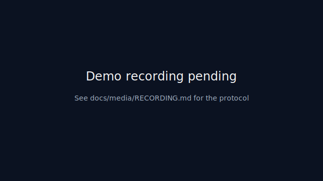
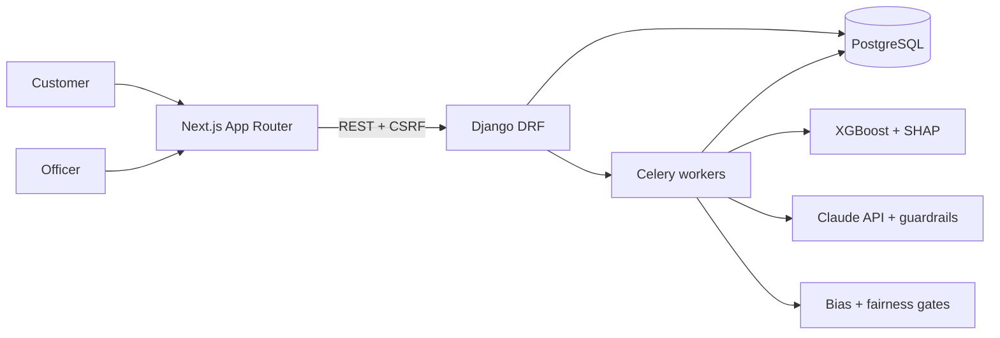

# Loan Approval AI System

[](https://github.com/zeroyuekun/loan-approval-ai-system/actions/workflows/ci.yml)


Calibrated ML + guardrailed LLM emails + bias gate + audit trail for Australian personal and home loans. Built against APRA APG 223, HEM (Melbourne Institute 2025/26), ASIC RG 209, and the February-2026 APRA macroprudential DTI cap.

**Try locally in 3 commands:**

```bash
git clone https://github.com/zeroyuekun/loan-approval-ai-system.git
cd loan-approval-ai-system
cp .env.example .env  # edit <REQUIRED> values, then re-run
make demo
```

Open http://localhost:3000. `make demo` seeds an admin user, 100 synthetic applicants, and the Neville Zeng golden home-loan fixture.



<!-- Placeholder — real GIF to be recorded later per docs/media/RECORDING.md -->

**Live demo:** not yet deployed — see [`docs/deployment/README.md`](docs/deployment/README.md) for Vercel + bring-your-own-backend self-host instructions.

## What this does

Predicts Australian personal and home loan approvals with a calibrated XGBoost model, generates NCCP-compliant decision emails via Claude with guardrails and template fallback, runs bias and fairness checks on every decision, surfaces per-decision SHAP explanations to officers, and escalates flagged cases to a human review queue.

## Architecture



Decision chain, in order: deterministic eligibility gates → calibrated XGBoost prediction → SHAP attribution → bias detection → compliant email generation → next-best-offer → audit trail. See the ADRs for the reasoning behind each boundary.

## Key design decisions

- [ADR-0001 — WAT framework boundary](docs/adr/0001-wat-framework-boundary.md): workflows, agents, tools as distinct layers
- [ADR-0002 — Shared feature-engineering module](docs/adr/0002-shared-feature-engineering-module.md): one function, zero train/serve skew
- [ADR-0003 — Optuna over grid search](docs/adr/0003-optuna-over-grid-search.md)
- [ADR-0004 — Celery single orchestrator task](docs/adr/0004-celery-single-orchestrator-task.md)
- [ADR-0005 — ModelVersion A/B routing](docs/adr/0005-modelversion-ab-routing.md)

## AU regulatory posture

- **NCCP 3% serviceability buffer** applied on every affordability assessment (`underwriting_engine.py`)
- **HEM** table from Melbourne Institute 2025/26 with per-state multipliers
- **APRA DTI ≥6 cap** (formalised Feb-2026) wired as a hard policy lever
- **ASIC INFO 146** — ACL number, Credit Guide, ADI disclaimer in the `Footer` component; NCCP Sch 1 comparison rate in the `ComparisonRate` component
- **AFCA contact** on `/rights` and in every footer
- **AHRC-aligned** bias/fairness pipeline; postcode used only via SA3 aggregation

See the [APP compliance matrix](docs/compliance/app-matrix.md) and the [threat model](docs/security/threat-model.md).

## Metrics

XGBoost achieves ~0.87 AUC on the synthetic holdout; the TSTR validator estimates a real-world AUC around 0.82 with moderate confidence. Every training run also fits a logistic-regression baseline on `credit_score, annual_income, loan_amount, debt_to_income` and records `training_metadata.baseline_auc` plus `xgb_lift_over_baseline`, so the main model's value-add is a specific number on the model card rather than marketing copy.

See the [model cards](docs/model-cards/) and the [benchmark](docs/experiments/benchmark.md) and [ablation](docs/experiments/ablations.md) artefacts for the full numbers.

## Limitations

- Training data is synthetic — real-world calibration on launch is unverified.
- Bureau + bank-feed services are stubbed (CDR, KYC, credit-bureau surfaces exist but do not hit real vendors).
- Retirement-age policy gate is modelled per NCCP but not legally reviewed.
- Local `make demo` uses shared Docker resources — cold start on constrained hardware can be 20–40 s on first boot.
- Customer-facing counterfactual / SHAP panel is on the Track C roadmap; only officers see SHAP today.

## Future work

- Track C (customer-facing counterfactual explanations) — future spec
- Event-driven orchestrator refactor with compensation — future spec
- OpenTelemetry distributed tracing — future spec
- CDR consent UI (service exists; UX deferred) — future spec

## Project structure

```
.
├── backend/                 Django 5 + DRF + Celery + XGBoost
│   └── apps/
│       ├── accounts/        Auth, KYC, address verification
│       ├── agents/          Orchestrator, bias detector, NBO
│       ├── email_engine/    Claude integration, guardrails, lifecycle
│       ├── loans/           Application CRUD, state machine, fraud
│       └── ml_engine/       Feature engineering, training, prediction, model cards
├── frontend/                Next.js 15 App Router + shadcn/ui
├── deploy/                  Vercel config and deploy assets
├── docs/                    ADRs, compliance, experiments, model cards, specs, plans
├── reports/                 Research reports (AU lenders, hiring signals, UX patterns)
├── workflows/               WAT SOPs
├── tools/                   Standalone Python utilities
└── Makefile                 `make help` for workflow targets
```

## Contributing

See [CONTRIBUTING.md](CONTRIBUTING.md).

## License

MIT. See `LICENSE`.
