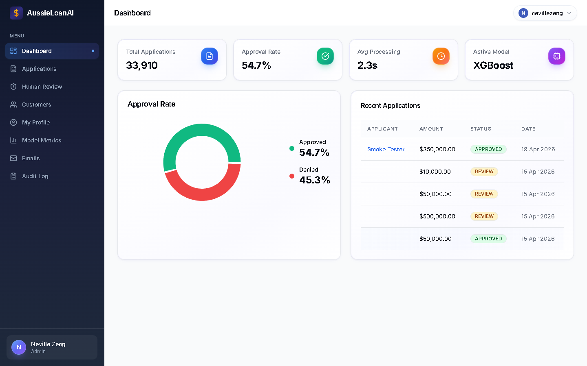
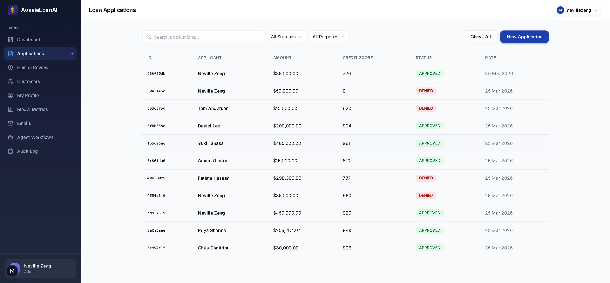
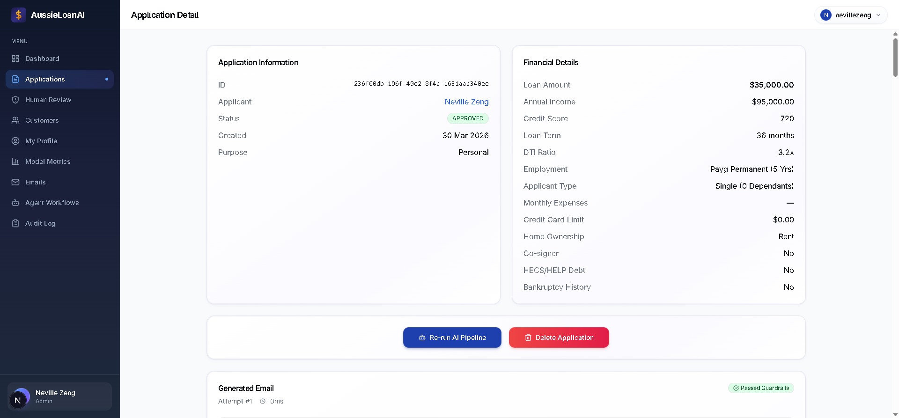
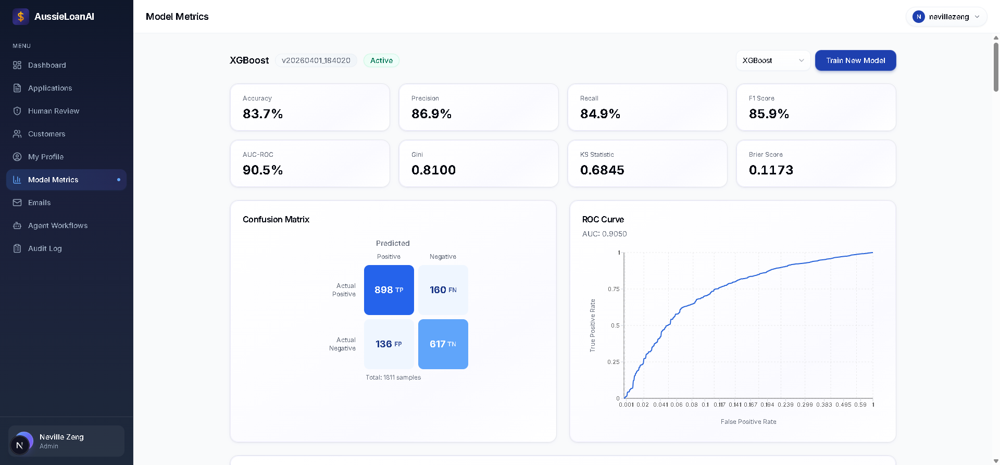
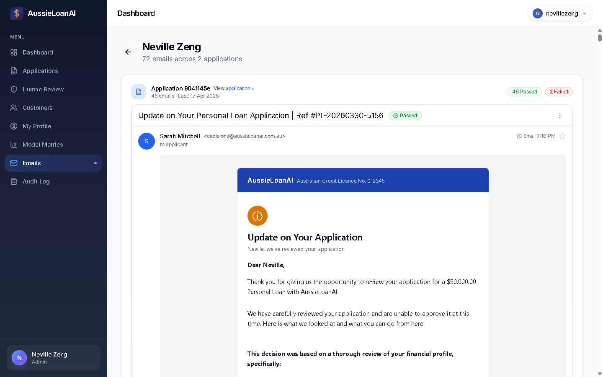
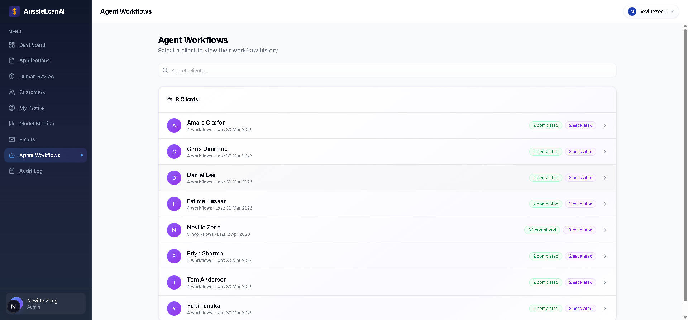

# Loan Approval AI System


Full-stack loan approval system built for Australian lending. ML scores applicants (XGBoost), Claude writes the decision emails, and an agent pipeline checks everything for bias before it goes out. The compliance layer — APRA serviceability buffers, NCCP Act responsible lending, Banking Code disclosure requirements — is where most of the work went.

<details>
<summary><strong>Screenshots</strong> (click to expand)</summary>

### Dashboard


### Loan Applications


### Application Detail


### Model Metrics


### Generated Emails


### Agent Workflows


</details>

## How the pipeline works

```
Application submitted
    |
    v
[1] XGBoost scores it --> probability + SHAP feature importances
    |
    v
[2] Claude writes the email --> approval or denial letter
    |
    v
[3] Guardrails check the email --> 10 deterministic checks
    |
    v
[4] Bias pre-screen (regex) --> scores 0-100
    |
    |-- score <= 60: pass, send the email
    |-- score 60-80: Claude reviews the flags
    |       \-- confidence < 0.70? escalate to human
    \-- score > 80: straight to human review
    |
    v
[5] Email sends (or gets held)
    |
    v
[6] If denied --> NBO engine generates alternative offers
    v
[7] Status updates, frontend picks it up on next poll
```

Failed steps put the application into "review" with a log of where it broke. Stuck pipelines auto-recover after 5 minutes.

## Stack

| Layer | Tech |
|-------|------|
| Backend | Django 5, DRF, PostgreSQL 17, Celery + Redis |
| Frontend | Next.js 15, React 19, TanStack Query, Tailwind, shadcn/ui |
| ML | scikit-learn, XGBoost, SHAP, Optuna |
| AI | Claude API (Sonnet for generation, Opus for compliance review) |
| Infra | Docker Compose, 7 containers, separate ML and IO Celery workers |

## Project layout

```
backend/
  apps/
    accounts/       # JWT auth, roles (admin, officer, customer)
    loans/          # application CRUD, status management, audit log
    ml_engine/      # training, prediction, drift detection, metrics
    email_engine/   # Claude emails, guardrails, pricing
    agents/         # bias detection, NBO, marketing agent, orchestrator
  config/           # settings, celery, urls

frontend/src/
  app/              # pages (dashboard, applications, agents, customers)
  components/       # shadcn/ui + domain components
  hooks/            # polling, mutations, auth

scripts/            # init_db.sh, seed_data.sh
tools/              # standalone training + evaluation scripts
workflows/          # markdown SOPs for each pipeline stage
```

## Design decisions

| Decision | ADR |
|----------|-----|
| Gaussian copula synthetic data calibrated to ATO/ABS/APRA stats | [001](backend/docs/adr/001-synthetic-data-with-copula.md) |
| XGBoost with monotonic constraints for regulatory consistency | [002](backend/docs/adr/002-xgboost-with-monotonic-constraints.md) |
| Three-layer bias detection (regex -> LLM -> human escalation) | [003](backend/docs/adr/003-hybrid-bias-detection.md) |
| Temporal validation strategy with out-of-time splits | [004](backend/docs/adr/004-temporal-validation-strategy.md) |
| Django over FastAPI | [005](backend/docs/adr/005-django-over-fastapi.md) |
| Template-first email with $5/day Claude budget cap | [006](backend/docs/adr/006-template-first-email-with-cost-cap.md) |
| WAT architecture (workflows, agents, tools) | [007](backend/docs/adr/007-wat-architecture.md) |
| Security architecture | [008](backend/docs/adr/008-security-architecture.md) |

## ML model

XGBoost trained on synthetic Australian lending data. 90+ features with 31 engineered interactions, Optuna Bayesian hyperparameter optimisation, isotonic probability calibration, 21 monotonic constraints (higher income -> lower risk, etc.).

The synthetic data is calibrated against ATO, ABS, APRA, and Equifax published statistics. It includes latent variables the model can't see (documentation quality, savings patterns, employer stability), underwriter disagreement noise, and measurement error — so the model hits realistic metrics (~0.86 AUC) rather than the 0.99 you get with clean synthetic labels.

Other ML features: IV-based feature selection, PSI/CSI drift monitoring, reject inference (parcelling method), conformal prediction intervals, SHAP-mapped adverse action reason codes (70 codes), APRA stress testing (+3% rate buffer), and a WOE scorecard built alongside XGBoost for interpretability comparison.

## Email guardrails

Every email Claude generates goes through 10 checks before sending:

1. Prohibited language (discrimination acts)
2. Hallucinated dollar amounts (validated against application data)
3. Aggressive tone
4. Overly formal/corporate phrasing
5. Unprofessional financial language
6. Markdown/HTML rejection (plain text only)
7. Word count limits
8. Required regulatory elements (AFCA reference, cooling-off period, etc.)
9. Double sign-off detection
10. Sentence rhythm uniformity (flags suspiciously even sentence lengths)

Three regeneration attempts, then human review.

## Running it

Requires Docker and an Anthropic API key.

```bash
git clone <repo-url>
cd loan-approval-ai-system
cp .env.example .env
# add your ANTHROPIC_API_KEY to .env

docker compose up -d
docker compose exec backend bash scripts/init_db.sh
docker compose exec backend bash scripts/seed_data.sh
```

Frontend at `localhost:3000`. Default login: `admin` / `admin1234`

To retrain:
```bash
docker compose exec backend python manage.py generate_data --num-records 10000 --output .tmp/synthetic_loans.csv
docker compose exec backend python manage.py train_model --algorithm xgb --data-path .tmp/synthetic_loans.csv
```

## API

Auth: `POST /api/v1/auth/{register,login,refresh,logout}/`, `GET /api/v1/auth/me/`

Loans: `GET /api/v1/loans/`, `POST /api/v1/loans/`, `GET /api/v1/loans/{id}/`

ML: `POST /api/v1/ml/predict/{id}/`, `GET /api/v1/ml/models/active/metrics/`

Emails: `POST /api/v1/emails/generate/{id}/`, `GET /api/v1/emails/{id}/`

Agents: `POST /api/v1/agents/orchestrate/{id}/`, `GET /api/v1/agents/runs/{id}/`, `POST /api/v1/agents/review/{id}/`

## Security

JWT with HttpOnly cookies, 60-min access / 7-day refresh with rotation and blacklisting. Argon2 password hashing. Fernet field-level encryption for PII. Rate limiting (20/min anon, 60/min auth). CORS locked to frontend origin. Three roles with per-endpoint permission checks. Prompt injection defences on user text entering LLM prompts.

## Monitoring and observability

A full monitoring stack ships in the same compose file behind the `monitoring` profile — Prometheus, Grafana, Loki, Promtail, Alertmanager, a Celery exporter, and a Postgres exporter. Django exposes `/metrics` via `django-prometheus` with request latencies, ORM query counts, Celery task counters, and a custom training-duration histogram. Nothing runs by default, so the core stack stays small; you opt in when you want dashboards.

Launch it alongside the regular stack:

```bash
docker compose --profile monitoring up -d
```

Then:

- Grafana at `localhost:3001` for dashboards (Django request latencies, Celery queue depth, Postgres slow queries, system logs)
- Prometheus at `localhost:9090` for raw metric queries
- Loki at `localhost:3100` as the log aggregation backend for Promtail

A separate `watchdog` service runs in the core stack at all times. It polls every 30 seconds for loan applications stuck in the `pending` state for more than 5 minutes and re-queues their orchestration task — so transient worker or broker failures self-recover rather than leaving zombie applications in the queue.

## Testing

~1000 tests across 92 files. 60% backend coverage floor enforced in CI. CI pipeline runs Ruff, Bandit SAST, gitleaks, npm audit, OWASP ZAP DAST, k6 load test, and Trivy container scanning.

## Limitations and honest caveats

- **Trained on synthetic data.** The data generator is calibrated against ATO, ABS, APRA, and Equifax published statistics and runs the labels through a 1000-line rules-based underwriting engine plus a separate loan-performance simulator, so the learning task is non-trivial. It does not capture real-world feedback loops, fraud patterns, broker channel effects, or lender-specific heuristics. A production rollout would retrain on real historical data before trusting the outputs.
- **Reported AUC is on the synthetic pipeline.** XGBoost achieves ~0.87 AUC on the synthetic holdout. The TSTR validator estimates a real-world AUC around 0.82 with moderate confidence. The project also reports a walk-forward temporal CV AUC in `training_metadata.temporal_cv_auc_mean` so the drift gap against random CV is visible.
- **XGBoost lift over a simple scorecard is measured, not assumed.** Every training run fits a logistic-regression baseline on `credit_score, annual_income, loan_amount, debt_to_income` and records `training_metadata.baseline_auc` plus `xgb_lift_over_baseline` so the main model's value-add is a specific number on the model card, not marketing copy.
- **Email generation is template-first.** Claude is used for creative variations only, and there is a $5/day spend cap on the Anthropic API. The guardrail layer runs 10 deterministic checks on every LLM-generated message before it ships.
- **Compliance framing is implemented, not audited.** APRA CPG 235, NCCP Act responsible lending, Banking Code disclosure, and the Australian regulatory language around adverse action are baked into the data model, email templates, and fairness gates. None of this has been independently reviewed by a compliance professional — it's a best-effort implementation for a portfolio project.
- **Reliability is prototype-grade.** All eight core services ship with healthchecks, the watchdog auto-recovers stuck pipelines, and the monitoring stack exposes Prometheus metrics and Grafana dashboards. There is no paging, no multi-region failover, and no SLO enforcement. Good enough for a demo, not a fintech launch.

## License

MIT
