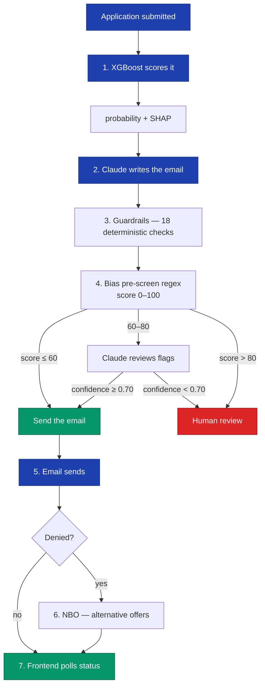

# Loan Approval AI System


Full-stack loan approval system built for Australian lending. ML scores applicants (XGBoost), Claude writes the decision emails, and an agent pipeline checks everything for bias before it goes out. The compliance layer — APRA serviceability buffers, NCCP Act responsible lending, Banking Code disclosure requirements — is where most of the work went.

<details>
<summary><strong>Screenshots</strong> (click to expand)</summary>

### Dashboard


### Loan Applications


### Application Detail


### Model Metrics


### Generated Emails


</details>

## How the pipeline works



Failed steps put the application into "review" with a log of where it broke. Stuck pipelines auto-recover after 5 minutes.

## Stack

| Layer | Tech |
|-------|------|
| Backend | Django 5, DRF, PostgreSQL 17, Celery + Redis |
| Frontend | Next.js 15, React 19, TanStack Query, Tailwind, shadcn/ui |
| ML | scikit-learn, XGBoost, SHAP, Optuna |
| AI | Claude API (Sonnet for generation, Opus for compliance review) |
| Infra | Docker Compose, 8 containers, separate ML and IO Celery workers, watchdog recovery |

## Run locally in 60 seconds

Prereqs: Docker Desktop (or Docker Engine + Compose v2), ~4 GB free RAM, an Anthropic API key.

```bash
git clone https://github.com/zeroyuekun/loan-approval-ai-system.git
cd loan-approval-ai-system
cp .env.example .env      # add ANTHROPIC_API_KEY
docker compose up -d      # backend, frontend, db, redis, ml + io workers
docker compose exec backend bash scripts/init_db.sh
docker compose exec backend bash scripts/seed_data.sh
```

Then:

- Dashboard → [http://localhost:3000](http://localhost:3000) — default login `admin` / `admin1234`
- API docs → [http://localhost:8000/api/schema/swagger-ui/](http://localhost:8000/api/schema/swagger-ui/)
- Tests → `docker compose exec backend pytest tests/ -v`

Something broken? See [runbooks](docs/runbooks/).

## Project layout

```
backend/
  apps/
    accounts/       # JWT auth, roles (admin, officer, customer)
    loans/          # application CRUD, status management, audit log
    ml_engine/      # training, prediction, drift detection, metrics
    email_engine/   # Claude emails, guardrails, pricing
    agents/         # bias detection, NBO, marketing agent, orchestrator
  config/           # settings, celery, urls

frontend/src/
  app/              # pages (dashboard, applications, agents, customers)
  components/       # shadcn/ui + domain components
  hooks/            # polling, mutations, auth

scripts/            # init_db.sh, seed_data.sh
tools/              # standalone training + evaluation scripts
workflows/          # markdown SOPs for each pipeline stage
```

## Design decisions

| Decision | ADR |
|----------|-----|
| Gaussian copula synthetic data calibrated to ATO/ABS/APRA stats | [001](backend/docs/adr/001-synthetic-data-with-copula.md) |
| XGBoost with monotonic constraints for regulatory consistency | [002](backend/docs/adr/002-xgboost-with-monotonic-constraints.md) |
| Three-layer bias detection (regex -> LLM -> human escalation) | [003](backend/docs/adr/003-hybrid-bias-detection.md) |
| Temporal validation strategy with out-of-time splits | [004](backend/docs/adr/004-temporal-validation-strategy.md) |
| Django over FastAPI | [005](backend/docs/adr/005-django-over-fastapi.md) |
| Template-first email with $5/day Claude budget cap | [006](backend/docs/adr/006-template-first-email-with-cost-cap.md) |
| WAT architecture (workflows, agents, tools) | [007](backend/docs/adr/007-wat-architecture.md) |
| Security architecture | [008](backend/docs/adr/008-security-architecture.md) |

## ML model

XGBoost trained on synthetic Australian lending data. 71 raw applicant input fields (48 numeric + categoricals) with 31 engineered interactions, Optuna Bayesian hyperparameter optimisation, isotonic probability calibration, 21 monotonic constraints (higher income -> lower risk, etc.).

The synthetic data is calibrated against ATO, ABS, APRA, and Equifax published statistics. It includes latent variables the model can't see (documentation quality, savings patterns, employer stability), underwriter disagreement noise, and measurement error — so the model hits realistic metrics (test AUC 0.88 per the active `ModelVersion`; reproducible benchmark on a 2,000-record subset is 0.85 with default hyperparameters — see `docs/experiments/benchmark.md`) rather than the 0.99 you get with clean synthetic labels.

Other ML features: IV-based feature selection, PSI/CSI drift monitoring, reject inference (parcelling method), conformal prediction intervals, SHAP-mapped adverse action reason codes (70 codes), APRA stress testing (+3% rate buffer), and a WOE scorecard built alongside XGBoost for interpretability comparison.

## Email guardrails

Every email Claude generates goes through 18 deterministic checks before sending (decision emails; marketing path runs an additional decline-language check for 19 total). The full list is in `backend/apps/email_engine/services/guardrails/engine.py`. Categories include:

1. Prohibited language (discrimination acts)
2. Hallucinated dollar amounts (validated against application data)
3. Aggressive tone
4. AI-giveaway phrasing (em-dashes, "moreover", uniform clause length)
5. Overly formal/corporate phrasing
6. Unprofessional financial language
7. Markdown/HTML rejection (plain text only)
8. Required regulatory elements (AFCA reference, cooling-off period, comparison-rate warning, etc.)
9. Comparison-rate warning on credit offers
10. Contextual dignity (no apology/sorry/disappointment in denials)
11. Psychological framing (no "unfortunately"-laden openings)
12. Patronising language
13. False urgency / scarcity
14. Guaranteed-approval language
15. Word count limits
16. Sign-off structure (no double sign-offs)
17. Sentence-rhythm uniformity (flags suspiciously even sentence lengths)
18. Call-to-action presence (every email must include a clear next step)

Three regeneration attempts, then human review.

## Retraining the model

```bash
docker compose exec backend python manage.py generate_data --num-records 10000 --output .tmp/synthetic_loans.csv
docker compose exec backend python manage.py train_model --algorithm xgb --data-path .tmp/synthetic_loans.csv
```

## API

Auth: `POST /api/v1/auth/{register,login,refresh,logout}/`, `GET /api/v1/auth/me/`

Loans: `GET /api/v1/loans/`, `POST /api/v1/loans/`, `GET /api/v1/loans/{id}/`

ML: `POST /api/v1/ml/predict/{id}/`, `GET /api/v1/ml/models/active/metrics/`

Emails: `POST /api/v1/emails/generate/{id}/`, `GET /api/v1/emails/{id}/`

Agents: `POST /api/v1/agents/orchestrate/{id}/`, `GET /api/v1/agents/runs/{id}/`, `POST /api/v1/agents/review/{id}/`

## Security

JWT with HttpOnly cookies, 60-min access / 7-day refresh with rotation and blacklisting. Argon2 password hashing. Fernet field-level encryption for PII. Rate limiting (20/min anon, 60/min auth). CORS locked to frontend origin. Three roles with per-endpoint permission checks. Prompt injection defences on user text entering LLM prompts.

## Monitoring and observability

A full monitoring stack ships behind the `monitoring` profile — Prometheus, Grafana, Loki, Promtail, Alertmanager, a Celery exporter, and a Postgres exporter. Django exposes `/metrics` via `django-prometheus` with request latencies, ORM query counts, Celery task counters, and custom histograms for training duration, end-to-end pipeline duration (`pipeline_e2e_seconds`), per-algorithm ML prediction latency, bias-review TTR, and an email-generation outcome counter. SLO targets and burn-rate alerts (`PipelineE2ESLOBurn`, `EmailGenerationErrorBudgetBurn`) are catalogued in [`docs/slo.md`](docs/slo.md). Nothing runs by default, so the core stack stays small; you opt in when you want dashboards.

Grafana lives in `docker-compose.monitoring.yml` so the main stack parses without a Grafana admin password. Before launching, set `GRAFANA_ADMIN_PASSWORD` in `.env` (compose refuses to start the monitoring profile without it — no silent fallback), then launch alongside the regular stack:

```bash
docker compose -f docker-compose.yml -f docker-compose.monitoring.yml --profile monitoring up -d
```

Or set `COMPOSE_FILE=docker-compose.yml:docker-compose.monitoring.yml` in `.env` to make both files the default, after which `docker compose --profile monitoring up -d` works as before.

Then:

- Grafana at `localhost:3001` for dashboards (Django request latencies, Celery queue depth, Postgres slow queries, system logs)
- Prometheus at `localhost:9090` for raw metric queries
- Loki at `localhost:3100` as the log aggregation backend for Promtail

A separate `watchdog` service runs in the core stack at all times. It polls every 30 seconds for loan applications stuck in the `pending` state for more than 5 minutes and re-queues their orchestration task — so transient worker or broker failures self-recover rather than leaving zombie applications in the queue.

## Testing

~1,125 tests across 84 files. 63% backend coverage floor enforced in CI. CI pipeline runs Ruff, Bandit SAST (high-severity / high-confidence gate), gitleaks, npm audit, OWASP ZAP DAST, k6 load test, and Trivy container scanning. A `workflow_dispatch`-only smoke-e2e job runs the full pipeline (register → apply → orchestrate → decision → email) against an ephemeral stack.

## Verifying the build

An end-to-end smoke script exercises the full pipeline (register → apply → orchestrate → decision → email) against a locally-running stack:

```bash
docker compose up -d
make seed                     # generate data + train model
tools/smoke_e2e.sh            # full cycle + teardown
tools/smoke_e2e.sh --keep-up  # leave stack up for manual inspection
```

Result is written to `.tmp/smoke_result.json`:

```json
{
  "started_at": "2026-04-19T12:34:56Z",
  "finished_at": "2026-04-19T12:35:42Z",
  "duration_ms": 46123,
  "status": "success",
  "reason": "ok",
  "model_version_id": "<uuid>",
  "email_subject_hash": "<sha256-prefix>"
}
```

The same script runs as a manually-triggered GitHub Actions job under `smoke-e2e` (see `.github/workflows/smoke-e2e.yml`). The workflow is `workflow_dispatch`-only by design — cost-conscious default; add a cron once the signal is known stable.

## Housekeeping

Local development accumulates build artifacts, test caches, and trained model files. To reclaim disk:

```bash
make clean-soft  # caches + build output ONLY — docker volumes (DB, redis) preserved
make clean       # FULL wipe: containers + volumes + caches (DB is wiped — use sparingly)
make clean-deep  # clean + removes node_modules and backend/.venv (forces reinstall)
```

Day-to-day, `make clean-soft` is the right default — it reclaims several hundred MB of Python/Next.js caches without touching the Postgres volume. Reserve `make clean` for "I want a fresh-from-seed DB".

To prune stale trained-model `.joblib` artifacts from `backend/ml_models/` (after many training iterations):

```bash
docker compose exec backend python manage.py prune_model_artifacts --dry-run  # preview
docker compose exec backend python manage.py prune_model_artifacts            # delete
```

## Limitations and honest caveats

- **Trained on synthetic data.** The data generator is calibrated against ATO, ABS, APRA, and Equifax published statistics and runs the labels through a 1000-line rules-based underwriting engine plus a separate loan-performance simulator, so the learning task is non-trivial. It does not capture real-world feedback loops, fraud patterns, broker channel effects, or lender-specific heuristics. A production rollout would retrain on real historical data before trusting the outputs.
- **Reported AUC is on the synthetic pipeline.** XGBoost achieves 0.88 AUC on the synthetic holdout of the active `ModelVersion` (see `backend/docs/MODEL_CARD.md`). The TSTR validator estimates a real-world AUC around 0.82 with moderate confidence. The project also reports a walk-forward temporal CV AUC in `training_metadata.temporal_cv_auc_mean` so the drift gap against random CV is visible.
- **XGBoost lift over a simple scorecard is measured, not assumed.** Every training run fits a logistic-regression baseline on `credit_score, annual_income, loan_amount, debt_to_income` and records `training_metadata.baseline_auc` plus `xgb_lift_over_baseline` so the main model's value-add is a specific number on the model card, not marketing copy.
- **Email generation is template-first.** Claude is used for creative variations only, and there is a $5/day spend cap on the Anthropic API. The guardrail layer runs 18 deterministic checks on every LLM-generated message before it ships.
- **Compliance framing is implemented, not audited.** APRA CPG 235, NCCP Act responsible lending, Banking Code disclosure, and the Australian regulatory language around adverse action are baked into the data model, email templates, and fairness gates. None of this has been independently reviewed by a compliance professional — it's a best-effort implementation for a portfolio project.
- **Reliability is prototype-grade.** All eight core services ship with healthchecks, the watchdog auto-recovers stuck pipelines, and the monitoring stack exposes Prometheus metrics and Grafana dashboards. There is no paging, no multi-region failover, and no SLO enforcement. Good enough for a demo, not a fintech launch.

## License

MIT
