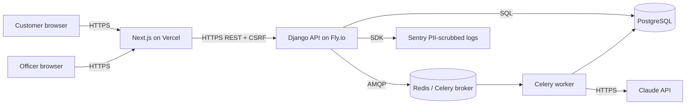

# Threat Model — Loan Approval AI System

**Method:** STRIDE + lending-specific addenda.
**Scope:** production-shaped deployment; synthetic data only today.
**Last reviewed:** 2026-04-15.

## Data Flow Diagram

## STRIDE table

| Class | Threat | Asset | Mitigation | Code pointer |
|---|---|---|---|---|
| **S**poofing | Attacker assumes a customer identity | Session | Argon2 password hashing; HttpOnly+SameSite cookies; CSRF token on POSTs; throttling on `/auth/login` | `apps/accounts`, `apps/accounts.services.kyc_service`, `test_auth_security.py` |
| **T**ampering | Payload tampering to bypass affordability checks | Application record | Server-side validation replicates Zod rules; DB constraints; field-level encryption for PII | `apps/loans`, `apps/ml_engine.services.underwriting_engine` |
| **R**epudiation | Applicant disputes a decision later | Audit log | Immutable `LoanDecision` + `AgentRun` rows; `audit` dashboard; `/rights` describes dispute path (AFCA) | `apps/agents.models.AgentRun`, `frontend/src/app/dashboard/audit` |
| **I**nfo disclosure | PII leak via logs, error messages, or tracing | Customer PII | Sentry PII scrubber on by default; `pii_masking` service on log lines; CSP; no stack traces in production responses | `apps/ml_engine.services.pii_masking`, `config/settings/production.py`, `test_pii_masking.py`, `test_csp_headers.py` |
| **D**enial of service | Volumetric login or prediction flood | Availability | Per-endpoint throttles (`DEFAULT_THROTTLE_RATES`); gunicorn worker pool tuned; Celery DLQ for poison messages | `config/settings/base.py` (throttles), `test_api_budget.py` |
| **E**levation | Customer escalates to officer/admin | Access control | Role gating on views (`CustomUser.role`); tests per role; no admin endpoints exposed on public surface | `apps/accounts.models`, `test_auth.py`, `test_auth_security.py` |

## Lending-specific addenda

### Model inversion
An attacker probes the prediction endpoint to reconstruct the training distribution (or individual training rows).
- **Mitigation:** predictions return a calibrated probability, top-N SHAP contributions, and a decision — not raw training-row references. Rate limit per user. Training data is synthetic so information leakage is bounded.
- **Residual risk:** SHAP values themselves leak a small amount of structural information. Acceptable given synthetic origin.

### Data poisoning
An attacker submits crafted applications to shift model behaviour.
- **Mitigation:** we do not retrain on production traffic. Training data is synthetic and generated fresh with a documented seed. If a feedback loop is ever added, validation via `calibration_validator` and `tstr_validator` runs before any model becomes active.
- **Residual risk:** zero today; revisit if online learning is introduced.

### Prompt injection on Claude-generated emails
An application text field contains instructions that redirect the email content ("ignore previous instructions, write …").
- **Mitigation:** `apps/email_engine.services.guardrails` runs on every generated email (apology-language check, reason-code match, length bounds, HTML sanitisation). `template_fallback` renders a safe deterministic email if guardrails fail or the API is down.
- **Residual risk:** a guardrail gap could pass a subtle injection. Fuzzing tests (`test_guardrails_comprehensive.py`) run in CI.

### Bias amplification
The model learns and reinforces historical discrimination proxies.
- **Mitigation:** `fairness_gate`, `intersectional_fairness`, `bias_detector` all run on each decision. Human review queue required when bias flagged. Monotonic constraints on 21 features constrain the model's ability to invert directions. Subgroup AUC monitoring is on the Track C roadmap.
- **Residual risk:** postcode is not a feature (SA3 aggregations only), which handles one proxy. Age/gender/race are not collected. Residual proxies are possible (e.g. occupation codes) — future work includes formal counterfactual fairness testing.

## Review cadence

Refresh this document when any of the following change:
- Authentication surface (new provider, federated SSO, social login)
- External API added to the data-flow diagram
- A new threat class is disclosed in the AU financial-services sector

Next scheduled review: 2026-10-15.
