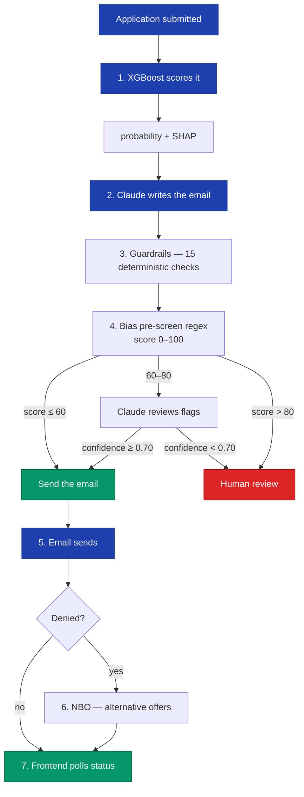

# Portfolio Production-Polish Implementation Plan

> **For agentic workers:** REQUIRED SUB-SKILL: Use `superpowers:subagent-driven-development` (recommended) or `superpowers:executing-plans` to implement this plan task-by-task. Steps use checkbox (`- [ ]`) syntax for tracking.

**Goal:** Execute the 18-item portfolio production-polish pass defined in the spec — two code-review passes plus 16 concrete PRs (13 planned + 3 P0 fold-ins) that add visible senior-SWE signals, fix three real bugs (DiCE timeout, Celery prefetch, frontend exit-243), close three P0-discovered issues (state-machine-bypass audit gap, Redis fallback counter thread-safety/reset, Celery integration test assertions), and produce a written engineering journal capturing decisions and tradeoffs for interview walkthroughs.

**Architecture:** One PR per item, all off `master`, serial merge. Each task is self-contained: branch → verify target state is absent → implement → verify target state present → commit → PR. Review passes (P0, P4) produce markdown reports, not code edits.

**Tech Stack:** Django 5 + DRF, Celery + Redis, scikit-learn + XGBoost, Claude API, Next.js 15 + React Query, Docker Compose. Tests: pytest + hypothesis + schemathesis (backend), Vitest (frontend). Lint: ruff (Python), ESLint + tsc (TypeScript). CI: GitHub Actions with bandit, pip-audit, npm audit, gitleaks, Trivy, OWASP ZAP, k6.

**Spec reference:** `docs/superpowers/specs/2026-04-17-portfolio-production-polish-design.md`

---

## File structure (what gets created or modified)

### New files
- `.pre-commit-config.yaml` — Task 2
- `backend/pyproject.toml` — Task 3
- `backend/requirements-dev.txt` — Task 3
- `.github/dependabot.yml` — Task 4
- `.github/CODEOWNERS` — Task 5
- `.github/PULL_REQUEST_TEMPLATE.md` — Task 5
- `.github/ISSUE_TEMPLATE/bug_report.md` — Task 5
- `.github/ISSUE_TEMPLATE/feature_request.md` — Task 5
- `.github/ISSUE_TEMPLATE/config.yml` — Task 5
- `docs/adr/README.md` — Task 6
- `docs/adr/000-template.md` — Task 6
- `docs/adr/001-xgboost-rf-ensemble.md` — Task 6
- `docs/runbooks/README.md` — Task 10
- `docs/runbooks/frontend-exit-243.md` — Task 10
- `docs/runbooks/celery-backpressure.md` — Task 10
- `docs/runbooks/migration-rollback.md` — Task 10
- `docs/slo.md` — Task 11
- `docs/compliance/australia.md` — Task 12
- `docs/engineering-journal.md` — Task 14 (A10)
- `docs/interview-talking-points.md` — Task 14 (A10)
- `docs/reviews/2026-04-17-p0-baseline.md` — Task 1
- `backend/tests/test_state_transition_audit.py` — Task 15 (B3)
- `backend/tests/test_api_budget_fallback.py` — Task 16 (B4)
- `docs/reviews/2026-04-17-p4-final.md` — Task 18 (date may shift)

### Modified files
- `backend/requirements.txt` — Task 3 (remove dev-only deps)
- `.github/workflows/ci.yml` — Task 3 (install dev deps)
- `backend/apps/ml_engine/services/counterfactual_engine.py` — Task 7
- Orchestrator caller of `CounterfactualEngine.generate` — Task 7 (verify during task)
- `backend/config/celery.py` — Task 8
- `README.md` — Task 9
- `frontend/Dockerfile` and/or `docker-compose.yml` — Task 13 (depends on root cause)

---

## Conventions (applied to every task)

**Branching:** `<type>/<id>-<slug>` off latest `master`. Examples: `docs/a1-adr-scaffold`, `fix/b1-dice-timeout`, `chore/a3-pre-commit`.

**Commit style:** Conventional commits. Types: `feat`, `fix`, `docs`, `chore`, `ci`, `refactor`, `test`. Scope in parens when useful. Body explains *why*. Always include `Co-Authored-By: Claude Opus 4.7 <noreply@anthropic.com>` line.

**PR rules:** One logical change. Target diff ≤ 300 lines including tests (docs PRs may exceed — content is the point). Squash-merge. No `--no-verify`. No amend-after-push.

**Testing floor:** CI must pass. Coverage not below current `--cov-fail-under=60`. Behavior PRs must add/modify a test.

**Serial merge:** Only one PR merged at a time. If master advances, rebase before merge.

---

## Task 1: P0 — Phase 0 baseline code review

**Purpose:** Get a fresh robustness read of the whole repo before starting the polish pass. Findings either fold into scope (critical) or become follow-up issues (medium/low).

**Files:**
- Create: `docs/reviews/2026-04-17-p0-baseline.md`

**Branch:** `review/p0-baseline`

- [ ] **Step 1: Create the branch**

```bash
git checkout master
git pull --ff-only origin master
git checkout -b review/p0-baseline
```

- [ ] **Step 2: Dispatch whole-repo code review**

Use the `superpowers:requesting-code-review` skill. Scope: entire backend + frontend, looking for robustness issues (latent bugs, silent error swallowing, dead code, weak test assertions, missing invariants, cross-module coupling, security holes not already caught by bandit/trivy). Include `backend/apps/**/*.py`, `frontend/src/**/*.{ts,tsx}`, key config files.

If that skill is unavailable, use `feature-dev:code-reviewer` or `code-review:code-review` with the same scope.

- [ ] **Step 3: Synthesize findings into a report**

Create `docs/reviews/2026-04-17-p0-baseline.md` with this structure:

```markdown
# Phase 0 Baseline Code Review — 2026-04-17

## Scope
Whole-repo review at commit <COMMIT_SHA> as the baseline before the
portfolio production-polish pass (spec: docs/superpowers/specs/2026-04-17-portfolio-production-polish-design.md).

## Findings (ranked)

| # | Finding | Category | Impact | Fix cost | Risk | Disposition |
|---|---------|----------|--------|----------|------|-------------|
| 1 | ... | ... | ... | ... | ... | fold-in / follow-up / parking-lot |

## Disposition rules
- **Fold-in** — must be fixed as part of this polish pass. Add a task below.
- **Follow-up** — file as a GitHub issue, track for a future pass.
- **Parking-lot** — note only, no action required.

## Added tasks
(If any findings are fold-in, list the new task IDs here and add them to the plan file.)

## Follow-up issues to file
(List titles; actually file them as `gh issue create` calls in a separate bookkeeping step or as part of Task 18's close-out.)
```

- [ ] **Step 4: Triage findings**

For each finding, decide: fold-in / follow-up / parking-lot. Use these rules:
- **Fold-in** if: security-critical, data-loss risk, obviously wrong behavior, or a test weakness that could hide regressions during this pass.
- **Follow-up** if: meaningful but scoped work that would expand this pass beyond 1-2 weeks.
- **Parking-lot** if: style preference, micro-optimization, or already known (see `project_optimization_audit_brainstorm.md` scope).

- [ ] **Step 5: Update plan if fold-ins exist**

If you marked any finding as "fold-in", add a corresponding task at the end of this plan (inserted after Task 17 and before Task 18 — P4 is always the last task) and update the spec's success criteria if needed. (Three fold-ins already added as Tasks 15/16/17 on 2026-04-17 — future P0 fold-ins would be Task 18+ and P4 renumbers accordingly.)

- [ ] **Step 6: Commit the report**

```bash
git add docs/reviews/2026-04-17-p0-baseline.md docs/superpowers/plans/2026-04-17-portfolio-production-polish.md
git commit -m "$(cat <<'EOF'
docs(review): P0 baseline code review for portfolio polish pass

Whole-repo robustness review run as Phase 0 of the portfolio
production-polish pass. Findings triaged into fold-in, follow-up,
and parking-lot dispositions.

Co-Authored-By: Claude Opus 4.7 <noreply@anthropic.com>
EOF
)"
```

- [ ] **Step 7: Open PR and merge**

```bash
git push -u origin review/p0-baseline
gh pr create --title "docs(review): P0 baseline code review" --body "Phase 0 of the portfolio production-polish pass. See \`docs/reviews/2026-04-17-p0-baseline.md\`."
```

Wait for CI green, then squash-merge.

---

## Task 2: A3 — `.pre-commit-config.yaml`

**Purpose:** Enforce ruff check, ruff format, and basic hygiene hooks locally so contributors get fast feedback instead of discovering failures in CI.

**Files:**
- Create: `.pre-commit-config.yaml`
- Modify: `CONTRIBUTING.md` (add a short setup step)

**Branch:** `chore/a3-pre-commit`

- [ ] **Step 1: Create branch and install pre-commit locally**

```bash
git checkout master && git pull --ff-only origin master
git checkout -b chore/a3-pre-commit
pip install pre-commit
```

- [ ] **Step 2: Write `.pre-commit-config.yaml`**

Create `.pre-commit-config.yaml` at repo root with this content:

```yaml
# pre-commit hooks
# Install: pip install pre-commit && pre-commit install
# Run manually: pre-commit run --all-files
repos:
  - repo: https://github.com/pre-commit/pre-commit-hooks
    rev: v5.0.0
    hooks:
      - id: trailing-whitespace
      - id: end-of-file-fixer
      - id: check-yaml
        args: [--allow-multiple-documents]
      - id: check-json
      - id: check-merge-conflict
      - id: check-added-large-files
        args: ["--maxkb=500"]
      - id: detect-private-key
      - id: mixed-line-ending

  - repo: https://github.com/astral-sh/ruff-pre-commit
    rev: v0.8.6
    hooks:
      - id: ruff
        args: [--fix, --exit-non-zero-on-fix]
        files: ^backend/
      - id: ruff-format
        files: ^backend/

  - repo: https://github.com/gitleaks/gitleaks
    rev: v8.21.2
    hooks:
      - id: gitleaks

exclude: |
  (?x)^(
    frontend/node_modules/.* |
    frontend/\.next/.* |
    backend/staticfiles/.* |
    .*\.min\.(js|css)
  )$
```

- [ ] **Step 3: Verify hooks trigger on a dry run**

```bash
pre-commit run --all-files 2>&1 | tee /tmp/precommit-dryrun.log
```

Expected: some hooks may report issues (trailing whitespace, line endings). That's fine — these are auto-fixable.

- [ ] **Step 4: Fix any issues pre-commit surfaces**

If hooks auto-fixed files, stage the fixes:
```bash
git add -u
```

If `ruff` reports legitimate lint errors, fix them by editing the reported files. If any finding is a false positive in a vendored/generated file, add to the `exclude:` block.

- [ ] **Step 5: Re-run hooks to confirm clean**

```bash
pre-commit run --all-files
```

Expected: all hooks Pass.

- [ ] **Step 6: Add setup step to `CONTRIBUTING.md`**

Open `CONTRIBUTING.md`. Add a new section near the top:

```markdown
## One-time setup

After cloning, install pre-commit hooks so they run on every commit:

```bash
pip install pre-commit
pre-commit install
```

Hooks run on staged files before commit. Run manually against everything with `pre-commit run --all-files`.
```

- [ ] **Step 7: Install the hook locally and commit**

```bash
pre-commit install
git add .pre-commit-config.yaml CONTRIBUTING.md
git commit -m "$(cat <<'EOF'
chore(dx): add pre-commit config (ruff, gitleaks, basic hygiene)

Local enforcement of what CI already runs, plus gitleaks + basic
whitespace/EOL/large-file hygiene. Surfaces failures before push
instead of in CI.

Co-Authored-By: Claude Opus 4.7 <noreply@anthropic.com>
EOF
)"
```

- [ ] **Step 8: Push and open PR**

```bash
git push -u origin chore/a3-pre-commit
gh pr create --title "chore(dx): add pre-commit config" --body "Local enforcement of ruff + gitleaks + hygiene hooks. See \`CONTRIBUTING.md\` for setup."
```

Wait for CI green, squash-merge.

---

## Task 3: A4 — `pyproject.toml` + dev-deps split

**Purpose:** Modern Python packaging. Separates runtime deps from dev/test deps. Surfaces project metadata + ruff config in a standard location.

**Files:**
- Create: `backend/pyproject.toml`
- Create: `backend/requirements-dev.txt`
- Modify: `backend/requirements.txt` (remove dev-only deps)
- Modify: `.github/workflows/ci.yml` (install both files)

**Branch:** `chore/a4-pyproject-dev-deps`

- [ ] **Step 1: Create branch**

```bash
git checkout master && git pull --ff-only origin master
git checkout -b chore/a4-pyproject-dev-deps
```

- [ ] **Step 2: Identify dev-only deps**

Read `backend/requirements.txt`. Classify each as runtime or dev:
- **Dev-only:** `pytest`, `pytest-django`, `hypothesis`, `schemathesis`
- **Runtime:** everything else (Django, DRF, celery, xgboost, pandas, sentry, anthropic, etc.)

Edge case: `optuna` is used for hyperparam tuning — runtime if training inside the app, dev-only if training is offline. Check by grepping for `import optuna` under `backend/apps/`. If only used by offline scripts, it's dev-only. Default: keep as runtime unless confirmed.

- [ ] **Step 3: Write `backend/pyproject.toml`**

Create `backend/pyproject.toml`:

```toml
[build-system]
requires = ["setuptools>=68", "wheel"]
build-backend = "setuptools.build_meta"

[project]
name = "loan-approval-backend"
version = "1.8.2"
description = "Australian loan approval AI system — Django backend"
requires-python = ">=3.13"
readme = "../README.md"
license = { file = "../LICENSE" }

[tool.ruff]
line-length = 120
target-version = "py313"
extend-exclude = [
  "migrations",
  "staticfiles",
  "manage.py",
]

[tool.ruff.lint]
select = ["E", "F", "W", "I", "B", "UP", "SIM", "DJ"]
ignore = ["E501"]  # line-length handled by formatter

[tool.ruff.format]
quote-style = "double"
indent-style = "space"

[tool.pytest.ini_options]
DJANGO_SETTINGS_MODULE = "config.settings.development"
python_files = ["test_*.py", "tests.py"]
python_classes = ["Test*"]
python_functions = ["test_*"]
addopts = "-v --tb=short --strict-markers"
markers = [
  "slow: marks tests as slow (deselect with -m 'not slow')",
  "integration: integration tests requiring services",
]
```

**Important:** if `backend/` already has a `pytest.ini`, `pyproject.toml`, or `setup.cfg` with pytest config, reconcile — don't duplicate. Move config from the old file into `pyproject.toml` and delete the old file in the same commit.

- [ ] **Step 4: Write `backend/requirements-dev.txt`**

Create `backend/requirements-dev.txt`:

```
# Dev/test-only dependencies
# Install alongside runtime deps: pip install -r requirements.txt -r requirements-dev.txt
-r requirements.txt

pytest==9.0.3
pytest-django==4.12.0
pytest-cov>=5.0
hypothesis>=6.100
schemathesis>=3.36
pre-commit>=4.0
ruff>=0.8.6
pip-audit>=2.7
```

- [ ] **Step 5: Update `backend/requirements.txt`**

Remove the dev-only lines identified in Step 2. After this edit, `requirements.txt` contains only runtime deps.

If there's a `requirements.in` file (source for `pip-compile`), mirror the change there and regenerate:
```bash
cd backend && pip-compile requirements.in --output-file=requirements.txt
```

- [ ] **Step 6: Update CI workflow**

Open `.github/workflows/ci.yml`. Find the `backend-test` job's `Install dependencies` step (line 66-68):

```yaml
      - name: Install dependencies
        working-directory: backend
        run: pip install -r requirements.txt pytest-cov
```

Replace with:

```yaml
      - name: Install dependencies
        working-directory: backend
        run: pip install -r requirements.txt -r requirements-dev.txt
```

Also check the `backend-lint` job — if it has a separate `pip install ruff` step, leave it (it's faster than installing all dev deps for lint only).

- [ ] **Step 7: Verify locally**

```bash
cd backend
pip install -r requirements.txt -r requirements-dev.txt
pytest tests/ --collect-only -q | head -20
ruff check .
ruff format --check .
cd ..
```

Expected: all commands succeed.

- [ ] **Step 8: Commit**

```bash
git add backend/pyproject.toml backend/requirements-dev.txt backend/requirements.txt .github/workflows/ci.yml
# Also add backend/requirements.in if modified, or backend/pytest.ini deletion if reconciled
git commit -m "$(cat <<'EOF'
chore(deps): split dev deps + add backend/pyproject.toml

Separates runtime deps (requirements.txt) from dev/test deps
(requirements-dev.txt). Centralises ruff + pytest config in
pyproject.toml. CI installs both files in backend-test; lint job
keeps its narrow ruff-only install.

Co-Authored-By: Claude Opus 4.7 <noreply@anthropic.com>
EOF
)"
```

- [ ] **Step 9: Push + PR + watch CI**

```bash
git push -u origin chore/a4-pyproject-dev-deps
gh pr create --title "chore(deps): split dev deps + add pyproject.toml" --body "Separates runtime from dev deps, centralises ruff + pytest config. Backwards-compatible with existing CI."
```

Watch CI. If a pytest or ruff job fails, likely the config migration dropped a setting — check the old `pytest.ini` / `setup.cfg` for anything not yet in `pyproject.toml`. Fix in a new commit on the same branch.

---

## Task 4: A8 — Dependabot config

**Purpose:** Auto-PR for CVE-relevant dependency updates. One config file.

**Files:**
- Create: `.github/dependabot.yml`

**Branch:** `chore/a8-dependabot`

- [ ] **Step 1: Create branch**

```bash
git checkout master && git pull --ff-only origin master
git checkout -b chore/a8-dependabot
```

- [ ] **Step 2: Write `.github/dependabot.yml`**

Create `.github/dependabot.yml`:

```yaml
version: 2
updates:
  - package-ecosystem: "pip"
    directory: "/backend"
    schedule:
      interval: "weekly"
      day: "monday"
      time: "08:00"
      timezone: "Australia/Sydney"
    open-pull-requests-limit: 5
    labels:
      - "dependencies"
      - "backend"
    groups:
      django-ecosystem:
        patterns:
          - "Django*"
          - "django-*"
          - "djangorestframework*"
      ml-stack:
        patterns:
          - "scikit-learn"
          - "xgboost"
          - "shap"
          - "dice-ml"
          - "pandas"
          - "numpy"
          - "joblib"
          - "optuna"

  - package-ecosystem: "npm"
    directory: "/frontend"
    schedule:
      interval: "weekly"
      day: "monday"
      time: "08:00"
      timezone: "Australia/Sydney"
    open-pull-requests-limit: 5
    labels:
      - "dependencies"
      - "frontend"
    groups:
      react-ecosystem:
        patterns:
          - "react"
          - "react-dom"
          - "@types/react*"
      next-ecosystem:
        patterns:
          - "next"
          - "eslint-config-next"

  - package-ecosystem: "github-actions"
    directory: "/"
    schedule:
      interval: "weekly"
    labels:
      - "dependencies"
      - "ci"
```

- [ ] **Step 3: Validate YAML**

```bash
python -c "import yaml; yaml.safe_load(open('.github/dependabot.yml'))"
```

Expected: no output (clean parse).

- [ ] **Step 4: Commit**

```bash
git add .github/dependabot.yml
git commit -m "$(cat <<'EOF'
chore(ci): add Dependabot config (pip, npm, github-actions)

Weekly grouped updates for Django, ML stack, React, Next.js ecosystems.
Sydney timezone so PRs land during business hours.

Co-Authored-By: Claude Opus 4.7 <noreply@anthropic.com>
EOF
)"
```

- [ ] **Step 5: Push + PR**

```bash
git push -u origin chore/a8-dependabot
gh pr create --title "chore(ci): add Dependabot config" --body "Weekly grouped dependency updates. Pip, npm, github-actions ecosystems."
```

- [ ] **Step 6: After merge, verify Dependabot is active**

In GitHub UI: Repo → Insights → Dependency graph → Dependabot. Should show the three ecosystems with "last run" timestamps within 24h.

---

## Task 5: A9 — CODEOWNERS, PR template, issue templates

**Purpose:** Review routing (even for solo repos, signals ownership) and consistent issue/PR format.

**Files:**
- Create: `.github/CODEOWNERS`
- Create: `.github/PULL_REQUEST_TEMPLATE.md`
- Create: `.github/ISSUE_TEMPLATE/bug_report.md`
- Create: `.github/ISSUE_TEMPLATE/feature_request.md`
- Create: `.github/ISSUE_TEMPLATE/config.yml`

**Branch:** `chore/a9-github-templates`

- [ ] **Step 1: Create branch**

```bash
git checkout master && git pull --ff-only origin master
git checkout -b chore/a9-github-templates
```

- [ ] **Step 2: Write `.github/CODEOWNERS`**

```
# CODEOWNERS — default reviewer for all paths
# GitHub user: zeroyuekun (Neville Zeng)

*                               @zeroyuekun

# Specific areas (future contributors can be added here)
/backend/apps/ml_engine/        @zeroyuekun
/backend/apps/email_engine/     @zeroyuekun
/backend/apps/agents/           @zeroyuekun
/frontend/                      @zeroyuekun
/.github/                       @zeroyuekun
```

- [ ] **Step 3: Write `.github/PULL_REQUEST_TEMPLATE.md`**

```markdown
## Summary
<!-- 1–3 bullets. What changed and why. -->

## Type
- [ ] feat — user-facing feature
- [ ] fix — bug fix
- [ ] docs — documentation only
- [ ] chore — tooling / config
- [ ] refactor — no behavior change
- [ ] test — test-only

## Scope (check all that apply)
- [ ] Backend (`backend/`)
- [ ] Frontend (`frontend/`)
- [ ] ML / model
- [ ] CI
- [ ] Docs
- [ ] Schema / migration

## Testing
<!-- How the change was verified. Commands run, tests added, manual checks. -->

- [ ] Unit tests pass locally
- [ ] Integration / e2e tests pass (if applicable)
- [ ] Manually verified in the browser (UI changes)
- [ ] No regression in coverage

## Rollout
- [ ] Safe to merge independently
- [ ] Requires coordinated deploy (explain below)
- [ ] Adds a migration

## Screenshots (UI only)
<!-- Drop before/after images here. -->

## Risk & rollback
<!-- What breaks if this is wrong? How do we roll back? -->
```

- [ ] **Step 4: Write `.github/ISSUE_TEMPLATE/bug_report.md`**

```markdown
---
name: Bug report
about: Something's broken or behaving unexpectedly
title: "bug: "
labels: ["bug"]
---

## What happened
<!-- Observable behaviour. Include error messages and stack traces. -->

## What you expected
<!-- What should have happened instead. -->

## How to reproduce
1. ...
2. ...
3. ...

## Environment
- Version / commit:
- OS:
- Browser (if frontend):
- Role (admin / officer / customer):

## Logs
<details>
<summary>Relevant logs</summary>

```
<paste logs here>
```
</details>

## Severity
- [ ] Critical — production outage, data loss, security
- [ ] High — major feature broken, no workaround
- [ ] Medium — feature impaired, workaround exists
- [ ] Low — cosmetic or edge case
```

- [ ] **Step 5: Write `.github/ISSUE_TEMPLATE/feature_request.md`**

```markdown
---
name: Feature request
about: Propose a new feature or enhancement
title: "feat: "
labels: ["enhancement"]
---

## Problem
<!-- What user pain or gap does this address? -->

## Proposed solution
<!-- High-level sketch of the feature. -->

## Alternatives considered
<!-- Other approaches you thought about and why they're worse. -->

## Scope
- [ ] Small (≤ 1 day)
- [ ] Medium (2–5 days)
- [ ] Large (> 5 days — consider breaking up)

## Impact on existing behaviour
<!-- Migrations? Breaking API changes? Config changes? -->
```

- [ ] **Step 6: Write `.github/ISSUE_TEMPLATE/config.yml`**

```yaml
blank_issues_enabled: false
contact_links:
  - name: Security issue
    url: https://github.com/zeroyuekun/loan-approval-ai-system/security/advisories/new
    about: Report vulnerabilities privately via GitHub Security Advisories.
```

- [ ] **Step 7: Commit**

```bash
git add .github/CODEOWNERS .github/PULL_REQUEST_TEMPLATE.md .github/ISSUE_TEMPLATE/
git commit -m "$(cat <<'EOF'
chore(repo): add CODEOWNERS, PR template, issue templates

Signals ownership (solo for now) and standardises PR/issue format.
Security issues routed to private advisories instead of public issues.

Co-Authored-By: Claude Opus 4.7 <noreply@anthropic.com>
EOF
)"
```

- [ ] **Step 8: Push + PR + verify**

```bash
git push -u origin chore/a9-github-templates
gh pr create --title "chore(repo): CODEOWNERS, PR template, issue templates" --body "Standardises PR + issue format. CODEOWNERS routes reviews. Security issues privatised."
```

Verify on the PR page: the PR body should render the template. After merge, `New issue` on GitHub should show the Bug / Feature choices.

---

## Task 6: A1 — ADR scaffold + first ADR

**Purpose:** Establish the Architecture Decision Record pattern. Senior-SWE signal that says "we thought about trade-offs and documented them."

**Files:**
- Create: `docs/adr/README.md`
- Create: `docs/adr/000-template.md`
- Create: `docs/adr/001-xgboost-rf-ensemble.md`

**Branch:** `docs/a1-adr-scaffold`

- [ ] **Step 1: Create branch**

```bash
git checkout master && git pull --ff-only origin master
git checkout -b docs/a1-adr-scaffold
```

- [ ] **Step 2: Write `docs/adr/README.md`**

```markdown
# Architecture Decision Records

This directory holds Architecture Decision Records (ADRs) for the Loan Approval AI System. An ADR captures a significant, intentional decision — what we chose, what we rejected, and why — so future contributors (and future us) can understand the system's shape.

## When to write an ADR

- You're choosing between multiple plausible architectures or libraries
- You're introducing a cross-cutting pattern (error handling, auth, caching)
- You're rejecting a plausible default in favour of something else
- A reviewer asks "why did you do it this way and not X?" and the answer deserves durable writing

Skip ADRs for routine implementation choices, library version bumps, or bug fixes.

## Process

1. Copy `000-template.md` to `NNN-short-slug.md` (NNN = next integer, zero-padded).
2. Fill in the sections. Keep it short — one page is ideal.
3. Status starts as **Proposed**. Open a PR.
4. Once merged, status becomes **Accepted**.
5. If later superseded, mark **Superseded by NNN-other-adr.md** at the top, don't delete.

## Index

- [001 — XGBoost + Random Forest ensemble](001-xgboost-rf-ensemble.md)

<!-- Append new ADRs here as they're written. -->
```

- [ ] **Step 3: Write `docs/adr/000-template.md`**

```markdown
# NNN — [Short decision title]

- **Status:** Proposed | Accepted | Superseded by [NNN](NNN-other.md)
- **Date:** YYYY-MM-DD
- **Decider:** @github-handle

## Context

What situation are we in? What problem needs deciding? Include constraints (performance, compliance, budget, team size).

## Decision

What did we choose?

## Consequences

What follows from this choice? Both the good and the costs. Be honest about trade-offs.

## Alternatives considered

What else was on the table?

### Option A — [name]
- Pros: ...
- Cons: ...
- Why we didn't pick this: ...

### Option B — [name]
- Pros: ...
- Cons: ...
- Why we didn't pick this: ...

## References

- Links to issues, PRs, external docs.
```

- [ ] **Step 4: Write `docs/adr/001-xgboost-rf-ensemble.md`**

This is the first real ADR — document the decision that's already made (XGBoost + Random Forest for loan scoring).

```markdown
# 001 — XGBoost + Random Forest ensemble for loan scoring

- **Status:** Accepted
- **Date:** 2026-04-17
- **Decider:** @zeroyuekun

## Context

The system scores Australian loan applicants (approve/deny probability). Model requirements:

- **Calibrated probabilities** — downstream guardrails and NBO use the raw probability, not just the class.
- **Interpretable** — NCCP responsible-lending obligations require decision reasoning (SHAP explanations). Neural nets are harder to justify.
- **Tabular data** — ~30 engineered features; no text / images.
- **Training data volume** — synthetic + seeded, ~10k rows. Not big-data scale.
- **Inference latency** — p95 < 500ms per applicant.
- **CPU-only inference** — runs in a Celery worker container, no GPU.

## Decision

Use an ensemble of XGBoost and Random Forest:
- **XGBoost (primary)** — gradient-boosted trees, tuned via Optuna. Usually the stronger single model on tabular data.
- **Random Forest (secondary)** — bagged trees. Lower variance on edge cases, cheaper fallback if XGBoost's prediction is marginal or the model artifact fails to load.
- The active algorithm is selected by `ModelVersion.is_active`; operators can swap without code changes.

SHAP runs on the active model for feature importances surfaced in the dashboard and denial emails.

## Consequences

**Good:**
- Both models are well-documented, CPU-friendly, and have mature SHAP integration.
- Two independent algorithms give a simple A/B lever during operation.
- Training, scoring, and explanation all run in-process in the Celery `ml` worker — no external inference service to operate.

**Costs:**
- Two model artifacts to version, not one. Mitigated by `ModelVersion.is_active` flag.
- XGBoost's dependency footprint (~30 MB per worker image) — acceptable given the single-image-per-queue deployment.
- Tree ensembles are less calibrated out-of-the-box than logistic regression; isotonic calibration is applied post-hoc and monitored via calibration plots in `/dashboard/model-metrics`.

## Alternatives considered

### A — Logistic regression only
- **Pros:** Simplest, perfectly interpretable, natively calibrated.
- **Cons:** Meaningfully lower AUC on the feature set (~0.80 vs ~0.87 Optuna-tuned).
- **Why not:** Approval quality matters more than implementation simplicity; the lift justifies the complexity.

### B — LightGBM
- **Pros:** Often a touch faster and slightly better than XGBoost on some tabular benchmarks.
- **Cons:** Slightly smaller ecosystem around SHAP integration; XGBoost was already familiar to the team.
- **Why not:** Incremental gain not worth the switch. Could revisit if inference latency becomes a constraint.

### C — Deep learning (TabNet / FT-Transformer)
- **Pros:** Strong on larger tabular datasets.
- **Cons:** Worse SHAP story, higher inference cost, overkill at our data size.
- **Why not:** Interpretability requirement makes this a poor fit. Data volume doesn't justify the capacity.

## References

- `backend/apps/ml_engine/services/trainer.py` — model training entry point.
- `backend/apps/ml_engine/models.py` — `ModelVersion` with `is_active` flag.
- `backend/apps/ml_engine/services/predictor.py` — inference.
- Optuna tuning notes: `project_ml_accuracy_context.md` (internal).
```

- [ ] **Step 5: Commit**

```bash
git add docs/adr/
git commit -m "$(cat <<'EOF'
docs(adr): scaffold ADR directory + record XGBoost+RF decision

Establishes docs/adr/ with README (index + process) and 000 template.
First real ADR (001) documents the existing XGBoost + Random Forest
ensemble choice — context, alternatives, consequences.

Co-Authored-By: Claude Opus 4.7 <noreply@anthropic.com>
EOF
)"
```

- [ ] **Step 6: Push + PR**

```bash
git push -u origin docs/a1-adr-scaffold
gh pr create --title "docs(adr): scaffold ADRs + XGBoost+RF decision (001)" --body "Establishes docs/adr/ with a template and the first real ADR — the existing ensemble decision."
```

---

## Task 7: B1 — DiCE timeout alignment + total_CFs reduction

**Purpose:** Fix the timeout mismatch (caller passes 10s, callee defaults to 15s — caller wins) and reduce `total_CFs` from 5 to 3 to cut generation time ~40%.

**Files:**
- Modify: `backend/apps/ml_engine/services/counterfactual_engine.py`
- Modify: Orchestrator caller (find in Step 2)
- Create/modify test: `backend/tests/ml_engine/test_counterfactual_engine.py` (path to confirm)

**Branch:** `fix/b1-dice-timeout`

- [ ] **Step 1: Create branch + locate caller**

```bash
git checkout master && git pull --ff-only origin master
git checkout -b fix/b1-dice-timeout
```

Find the orchestrator call with:
```bash
cd backend && grep -rn "counterfactual_engine\|CounterfactualEngine\|\.generate(" apps/agents/ apps/ml_engine/ | grep -v test
```

Identify the file and line where `.generate(features_df, original_loan_amount, timeout_seconds=10)` (or similar) is called. Expected: somewhere in `apps/agents/services/` or `apps/ml_engine/services/`.

- [ ] **Step 2: Find or create the test file**

```bash
ls backend/tests/ml_engine/ 2>/dev/null || find backend/tests -name "*counterfactual*"
```

If `test_counterfactual_engine.py` exists, edit it. If not, create at `backend/tests/ml_engine/test_counterfactual_engine.py`.

- [ ] **Step 3: Write a failing test for the timeout default + total_CFs**

Add (or append) this test:

```python
# backend/tests/ml_engine/test_counterfactual_engine.py
import inspect

from apps.ml_engine.services.counterfactual_engine import CounterfactualEngine


def test_generate_default_timeout_is_20_seconds():
    """B1: caller/callee timeout mismatch fix — generate() defaults to 20s."""
    sig = inspect.signature(CounterfactualEngine.generate)
    param = sig.parameters["timeout_seconds"]
    assert param.default == 20, (
        f"generate() default timeout should be 20s after B1 fix; got {param.default}"
    )


def test_dice_total_cfs_is_three():
    """B1: total_CFs reduced 5→3 to cut DiCE wall time."""
    src = inspect.getsource(CounterfactualEngine._dice_counterfactuals)
    # Accept either `total_CFs=3` or `total_CFs = 3` formatting
    assert "total_CFs=3" in src or "total_CFs = 3" in src, (
        "DiCE call should use total_CFs=3 after B1 fix"
    )
```

- [ ] **Step 4: Run test — expect failure**

```bash
cd backend
pytest tests/ml_engine/test_counterfactual_engine.py::test_generate_default_timeout_is_20_seconds tests/ml_engine/test_counterfactual_engine.py::test_dice_total_cfs_is_three -v
```

Expected: both FAIL — current default is `timeout_seconds: int = 15`, `total_CFs=5`.

- [ ] **Step 5: Apply the code fix**

Edit `backend/apps/ml_engine/services/counterfactual_engine.py`:

1. Change `generate()` default timeout:
   - Find: `timeout_seconds: int = 15,`
   - Replace: `timeout_seconds: int = 20,`
2. Change `_dice_counterfactuals` total_CFs:
   - Find: `total_CFs=5,`
   - Replace: `total_CFs=3,`

Also update the orchestrator caller found in Step 1 — either remove the explicit `timeout_seconds=10` argument (let the default apply) or change to `timeout_seconds=20` for clarity. Prefer removing the explicit value so the default is the single source of truth.

- [ ] **Step 6: Run the targeted tests — expect pass**

```bash
cd backend
pytest tests/ml_engine/test_counterfactual_engine.py -v
```

Expected: both new tests PASS.

- [ ] **Step 7: Run the wider ML test suite — expect no regression**

```bash
cd backend
pytest tests/ml_engine/ -v
```

Expected: all existing tests still PASS.

- [ ] **Step 8: Run the agents / orchestrator suite — expect no regression**

```bash
cd backend
pytest tests/agents/ -v
```

Expected: all PASS. If any test asserted on the old `timeout_seconds=10` or `total_CFs=5`, update it to the new values.

- [ ] **Step 9: Commit**

```bash
git add backend/apps/ml_engine/services/counterfactual_engine.py backend/tests/ml_engine/test_counterfactual_engine.py
# Also add the orchestrator file if modified
git commit -m "$(cat <<'EOF'
fix(ml_engine): align DiCE timeout + cut total_CFs 5->3

Caller and callee used different timeout values (10s vs 15s default),
so the shorter caller value always won — falling back before DiCE
could finish. Align both on 20s and reduce total_CFs from 5 to 3 to
cut genetic search time ~40%. Removes most timeout-driven fallbacks
on denied applicants.

Co-Authored-By: Claude Opus 4.7 <noreply@anthropic.com>
EOF
)"
```

- [ ] **Step 10: Push + PR**

```bash
git push -u origin fix/b1-dice-timeout
gh pr create --title "fix(ml_engine): align DiCE timeout + cut total_CFs" --body "Caller/callee timeout mismatch — fallback was firing before DiCE could finish. Align on 20s + reduce total_CFs 5->3 (~40% faster search)."
```

---

## Task 8: B2 — Celery prefetch + acks_late

**Purpose:** Current Celery config uses the Django default prefetch_multiplier (4) and task_acks_early. Tune per workload: ml queue CPU-heavy (prefetch=1, avoid starving other workers), email/agents IO-heavy (prefetch=2). Turn on acks_late for at-least-once semantics on worker crashes. Also switch to JSON task payloads — the Celery default allows arbitrary-type deserialization, JSON is safer and more inspectable.

**Files:**
- Modify: `backend/config/celery.py`
- Create/modify: `backend/tests/config/test_celery_config.py`

**Branch:** `fix/b2-celery-prefetch`

- [ ] **Step 1: Create branch + read current Celery config**

```bash
git checkout master && git pull --ff-only origin master
git checkout -b fix/b2-celery-prefetch
cat backend/config/celery.py
```

- [ ] **Step 2: Write a failing test for the expected config**

Create `backend/tests/config/test_celery_config.py` (or append to existing):

```python
"""B2: Celery worker tuning tests."""
from config.celery import app


def test_task_acks_late_enabled():
    """Tasks should be acknowledged after execution, not before.

    This gives at-least-once semantics — if a worker dies mid-task,
    the broker re-delivers it to another worker.
    """
    assert app.conf.task_acks_late is True


def test_worker_prefetch_multiplier_conservative():
    """Prefetch multiplier tuned down from default 4.

    For the agents orchestration + ml queues we prefer strict
    ordering + fair dispatch over throughput. Value of 1-2 both
    acceptable as a global default.
    """
    assert app.conf.worker_prefetch_multiplier in (1, 2)


def test_task_reject_on_worker_lost_true():
    """If a worker is killed (OOM / SIGKILL), requeue the task."""
    assert app.conf.task_reject_on_worker_lost is True


def test_task_serializer_is_json():
    """JSON serialiser for tasks + results. Safer than the default."""
    assert app.conf.task_serializer == "json"
    assert app.conf.result_serializer == "json"
    assert "json" in app.conf.accept_content
```

- [ ] **Step 3: Run test — expect failures**

```bash
cd backend
pytest tests/config/test_celery_config.py -v
```

Expected: most (if not all) FAIL against the current config.

- [ ] **Step 4: Apply the Celery config changes**

Open `backend/config/celery.py`. After the existing `app = Celery(...)` line and any `app.config_from_object(...)` call, add (or update existing settings to match):

```python
# --- Worker tuning (B2) -----------------------------------------------------
# Prefer fair dispatch + at-least-once semantics over raw throughput.
# Per-queue prefetch is configured on the worker command line in
# docker-compose (e.g. --prefetch-multiplier=1 for ml queue, 2 for
# io-heavy queues). This is the safe global default.
app.conf.worker_prefetch_multiplier = 2

# Acknowledge tasks only after successful execution; if a worker dies
# mid-task, the broker re-delivers to another worker.
app.conf.task_acks_late = True
app.conf.task_reject_on_worker_lost = True

# Pin JSON for task payloads + results. Safer and more portable than
# the default serialiser; inspectable in Flower / logs.
app.conf.task_serializer = "json"
app.conf.result_serializer = "json"
app.conf.accept_content = ["json"]

# Worker restart every N tasks to mitigate memory leaks (common with
# ML worker processes importing large libs).
app.conf.worker_max_tasks_per_child = 1000
```

**If `app.config_from_object(...)` is used with a `CELERY_` namespace**, these settings should be mirrored in Django settings as:
```python
CELERY_WORKER_PREFETCH_MULTIPLIER = 2
CELERY_TASK_ACKS_LATE = True
CELERY_TASK_REJECT_ON_WORKER_LOST = True
CELERY_TASK_SERIALIZER = "json"
CELERY_RESULT_SERIALIZER = "json"
CELERY_ACCEPT_CONTENT = ["json"]
CELERY_WORKER_MAX_TASKS_PER_CHILD = 1000
```
Choose the style matching the existing codebase — don't mix.

- [ ] **Step 5: Update docker-compose for per-queue prefetch**

Open `docker-compose.yml`. Find the `celery_worker_ml` / `celery_worker_agents` / `celery_worker_email` service definitions (or whatever they're named). Each should have a command like:

```yaml
command: celery -A config worker --loglevel=info --queues=ml --concurrency=2 --prefetch-multiplier=1
```

Adjust per queue:
- ml queue: `--prefetch-multiplier=1` (CPU-heavy — don't hoard tasks)
- agents queue: `--prefetch-multiplier=1` (strict ordering matters)
- email queue: `--prefetch-multiplier=2` (IO-heavy, can overlap)

If queue separation isn't actually done via separate services yet, skip this sub-step and leave the global default. Document the finding in a follow-up issue.

- [ ] **Step 6: Run the Celery test — expect pass**

```bash
cd backend
pytest tests/config/test_celery_config.py -v
```

Expected: all 4 tests PASS.

- [ ] **Step 7: Run the agent orchestration suite — expect no regression**

```bash
cd backend
pytest tests/agents/ -v
```

Expected: all PASS. If tests mock Celery, make sure mocks don't break on new config.

- [ ] **Step 8: Commit**

```bash
git add backend/config/celery.py backend/tests/config/test_celery_config.py docker-compose.yml
git commit -m "$(cat <<'EOF'
fix(celery): tune prefetch, acks_late, JSON serialisation

Switches default worker_prefetch_multiplier 4->2 and turns on
task_acks_late + task_reject_on_worker_lost for at-least-once
semantics on crashes. Pins JSON serialisation for task payloads
(safer than the default that deserialises arbitrary types). Sets
worker_max_tasks_per_child=1000 to mitigate ML worker leaks.

Per-queue prefetch is configured on the worker command line
(ml=1, agents=1, email=2).

Co-Authored-By: Claude Opus 4.7 <noreply@anthropic.com>
EOF
)"
```

- [ ] **Step 9: Push + PR**

```bash
git push -u origin fix/b2-celery-prefetch
gh pr create --title "fix(celery): tune prefetch, acks_late, JSON serialisation" --body "At-least-once semantics on crashes + fair dispatch + JSON payloads. Per-queue prefetch on worker command line."
```

---

## Task 9: A2 — README polish + Mermaid architecture diagram

**Purpose:** The README is already strong (badges, ASCII pipeline, stack table, screenshots). Polish gaps: render architecture as Mermaid (better than ASCII on GitHub), add a "Run locally in 60 seconds" quickstart, verify screenshots + links, tighten wording.

**Files:**
- Modify: `README.md`

**Branch:** `docs/a2-readme-polish`

- [ ] **Step 1: Create branch + read current README**

```bash
git checkout master && git pull --ff-only origin master
git checkout -b docs/a2-readme-polish
cat README.md
```

- [ ] **Step 2: Verify screenshot files exist**

```bash
ls docs/screenshots/
```

Confirm: `01-dashboard.png` through `06-agent-workflows.png` exist. If any are missing, either add them or remove the broken reference before committing.

- [ ] **Step 3: Replace the ASCII pipeline with Mermaid**

In `README.md`, find the "How the pipeline works" section with the ASCII flow (starting around line 32). Replace the ASCII block with:

````markdown
## How the pipeline works



Failed steps put the application into "review" with a log of where it broke. Stuck pipelines auto-recover after 5 minutes.
````

- [ ] **Step 4: Add a "Run locally in 60 seconds" quickstart**

Find the existing "Project layout" section. Before it, add:

````markdown
## Run locally in 60 seconds

Prereqs: Docker Desktop (or Docker Engine + Compose v2), ~4 GB free RAM.

```bash
git clone https://github.com/zeroyuekun/loan-approval-ai-system.git
cd loan-approval-ai-system
cp .env.example .env      # fill in ANTHROPIC_API_KEY
docker compose up -d      # builds + starts backend, frontend, db, redis, workers
```

Then:

- Dashboard → [http://localhost:3000](http://localhost:3000) (default admin: `admin` / `admin123`)
- API docs → [http://localhost:8000/api/schema/swagger-ui/](http://localhost:8000/api/schema/swagger-ui/)

Run the test suite:
```bash
docker compose exec backend pytest tests/ -v
```

Something broken? See [runbooks](docs/runbooks/).
````

(The runbooks link will resolve once Task 10 lands. Acceptable ordering risk — this task may merge before Task 10. In that case the link 404s for a few hours until Task 10 merges. If that's unacceptable, reorder: do Task 10 first.)

- [ ] **Step 5: Render-check on GitHub**

Push a WIP commit and view the PR's "Files changed" tab to confirm Mermaid renders. GitHub natively renders Mermaid in markdown.

- [ ] **Step 6: Commit**

```bash
git add README.md
git commit -m "$(cat <<'EOF'
docs(readme): Mermaid architecture diagram + 60-second quickstart

Replaces ASCII pipeline with a Mermaid flowchart that renders natively
on GitHub. Adds a 'Run locally in 60 seconds' section with concrete
docker compose commands + default admin credentials + API docs URL.

Co-Authored-By: Claude Opus 4.7 <noreply@anthropic.com>
EOF
)"
```

- [ ] **Step 7: Push + PR**

```bash
git push -u origin docs/a2-readme-polish
gh pr create --title "docs(readme): Mermaid diagram + quickstart" --body "Mermaid renders better than ASCII on GitHub. Quickstart gets a new visitor from clone to dashboard in 60s."
```

---

## Task 10: A5 — Runbooks

**Purpose:** Write three operational runbooks: frontend container exit-243, Celery queue backpressure, migration rollback. Format each as symptoms → diagnose → remediate → escalate.

**Files:**
- Create: `docs/runbooks/README.md`
- Create: `docs/runbooks/frontend-exit-243.md`
- Create: `docs/runbooks/celery-backpressure.md`
- Create: `docs/runbooks/migration-rollback.md`

**Branch:** `docs/a5-runbooks`

- [ ] **Step 1: Create branch**

```bash
git checkout master && git pull --ff-only origin master
git checkout -b docs/a5-runbooks
```

- [ ] **Step 2: Write `docs/runbooks/README.md`**

```markdown
# Runbooks

Operational procedures for incidents and known failure modes. Each runbook follows the same structure so it's fast to use under pressure.

## How to use

1. Match symptoms to a runbook title.
2. Follow **Diagnose** to confirm the cause — don't skip this, the remediation only works if the diagnosis is right.
3. Follow **Remediate** to restore service.
4. If remediation fails, **Escalate** tells you who to tag and what data to attach.

## Index

- [Frontend container exits with code 243](frontend-exit-243.md)
- [Celery queue backpressure](celery-backpressure.md)
- [Migration rollback](migration-rollback.md)

## Adding a runbook

Copy an existing runbook file, replace content, and add to the index.
```

- [ ] **Step 3: Write `docs/runbooks/frontend-exit-243.md`**

```markdown
# Frontend container exits with code 243

**Severity:** High — end users can't reach the UI.

## Symptoms

- `docker compose ps frontend` shows `exited (243)` in a loop
- Browsers at port 3000 see "connection refused" or immediate 502
- Container restarts every 10–30 seconds

## Diagnose

1. **Get the last logs before the exit:**

   ```bash
   docker compose logs --tail 200 frontend
   ```

2. **Common signatures:**

   | Signature in logs | Likely cause |
   |-------------------|--------------|
   | `JavaScript heap out of memory` / `FATAL ERROR: Reached heap limit` | Node OOM during build or SSR |
   | `Error: listen EADDRINUSE` | Port conflict inside container |
   | `unable to resolve host` (for the backend) | Networking — `depends_on` or service name mismatch |
   | `health check failed` / no logs at all, just a restart | Healthcheck timing out before app is ready |
   | `kill -9` without message | OOM at container level (cgroup limit) |

3. **Check cgroup memory limit:**

   ```bash
   docker inspect $(docker compose ps -q frontend) --format '{{.HostConfig.Memory}}'
   ```

   Value `0` means no limit. A low limit (e.g. 134217728 = 128 MB) with a Next.js build will OOM every time.

4. **Exit code 243 specifically** usually means Node exited with code 115 (128+115 = 243). Common cause: Node hit its heap limit and exited.

## Remediate

**If OOM (most common):**

1. Edit `docker-compose.yml` frontend service:
   ```yaml
   services:
     frontend:
       deploy:
         resources:
           limits:
             memory: 1G
       environment:
         NODE_OPTIONS: "--max-old-space-size=768"
   ```

2. Rebuild + restart:
   ```bash
   docker compose up -d --build frontend
   docker compose logs -f frontend
   ```

**If healthcheck timeout:**

In the frontend service, extend `healthcheck.start_period`:
```yaml
healthcheck:
  start_period: 60s
  interval: 10s
  timeout: 5s
  retries: 5
```

**If networking:**

Confirm the backend hostname used by the frontend container matches the service name in compose. Run `docker compose exec frontend ping backend`.

## Escalate

If the container still crash-loops after applying the fix above:

- Attach to the escalation issue: full `docker compose logs frontend` output (at least 500 lines), `docker inspect frontend` JSON, and `docker stats frontend --no-stream`.
- Tag the Frontend and Infra owners from `.github/CODEOWNERS`.
- If production is affected: flip the "maintenance mode" feature flag (once implemented) or route DNS to a static status page.
```

- [ ] **Step 4: Write `docs/runbooks/celery-backpressure.md`**

```markdown
# Celery queue backpressure

**Severity:** Medium–High — applications submitted but decisions not rendering; users see "processing" for minutes.

## Symptoms

- Dashboard shows applications stuck at "scoring" / "generating email"
- `POST /applications/` returns 202 but the status endpoint never advances past "queued"
- Redis queue length grows faster than workers drain it

## Diagnose

1. **Queue depth per queue:**
   ```bash
   docker compose exec redis redis-cli -a "$REDIS_PASSWORD" LLEN celery
   docker compose exec redis redis-cli -a "$REDIS_PASSWORD" LLEN ml
   docker compose exec redis redis-cli -a "$REDIS_PASSWORD" LLEN agents
   docker compose exec redis redis-cli -a "$REDIS_PASSWORD" LLEN email
   ```

   Healthy: each < 50. Backpressure: growing monotonically.

2. **Worker heartbeat:**
   ```bash
   docker compose exec backend celery -A config inspect active --timeout 5
   docker compose exec backend celery -A config inspect stats --timeout 5
   ```

   If a worker doesn't respond, it's dead or stuck.

3. **Worker logs for OOM / unhandled exceptions:**
   ```bash
   docker compose logs --tail 500 celery_worker_ml
   docker compose logs --tail 500 celery_worker_agents
   ```

4. **Common causes (in order of frequency):**
   - Worker OOM killed by container (see frontend-exit-243 runbook for the memory-limit pattern)
   - Long-running task exceeding `task_soft_time_limit`
   - Redis password mismatch causing workers to silently drop
   - Dead-letter build-up (check `celery_results` table in Postgres)

## Remediate

**Clear backlog safely:**

1. Scale up workers temporarily:
   ```bash
   docker compose up -d --scale celery_worker_ml=3 --scale celery_worker_agents=2
   ```

2. If a specific task type is stuck, **do not blindly purge the queue** — purging loses applications. Instead:
   - `celery -A config inspect reserved` to see what's stuck
   - Identify the task IDs
   - Revoke only those: `celery -A config control revoke <task_id>`

3. Restart workers if their process heap looks bloated (RSS > 2x the average):
   ```bash
   docker compose restart celery_worker_ml
   ```
   Workers will re-consume from Redis; `task_acks_late=True` means in-flight tasks come back.

**Purge only in a dev environment.** In production, file an incident and drain manually.

## Escalate

- Attach: queue lengths (all queues, 3 readings 10 minutes apart), worker logs (500 lines each), Flower dashboard screenshot.
- Tag Backend + Infra owners.
- If P95 latency > 5 min for > 30 min: flip the "predictions-via-sync-fallback" feature flag (once implemented) so the API blocks on ML instead of queueing.
```

- [ ] **Step 5: Write `docs/runbooks/migration-rollback.md`**

```markdown
# Migration rollback

**Severity:** depends on the migration — critical if it's already partially applied in production.

## Symptoms

- A deploy included a Django migration that caused errors / data corruption / unacceptable slowness
- `python manage.py migrate` failed halfway
- A new column / constraint is making existing queries blow up

## Diagnose

1. **Find the bad migration:**
   ```bash
   docker compose exec backend python manage.py showmigrations --plan | tail -20
   ```

   The latest `[X]` applied entry is where rollback starts.

2. **Check if the migration is reversible:**
   ```bash
   grep -n "migrations.RunPython" backend/apps/*/migrations/<NNNN>*.py
   ```

   `RunPython` without a `reverse_code` function is **irreversible** — you need a forward-only compensating migration, not a rollback.

3. **Check data changes:**
   If the migration ran `RunPython` that modified rows, rolling back the schema won't unmodify the data. You may need a data repair migration.

## Remediate

**For a reversible migration on a single app:**

```bash
docker compose exec backend python manage.py migrate <app_label> <previous_migration_number>
# Example: migrate loans 0023_before_bad_migration
```

**For an irreversible migration:**

1. Author a **forward-only compensating migration** in the same app:
   ```bash
   docker compose exec backend python manage.py makemigrations --empty <app_label>
   ```
2. Fill in the compensating operations (drop column, re-add dropped constraint, restore data from backup).
3. Commit via the normal PR flow — **no emergency bypass**, CI must still pass.
4. Deploy and apply the compensating migration.

**For a migration that corrupted data:**

1. Stop writes to the affected tables if safe (maintenance mode).
2. Restore the affected tables from the most recent Postgres backup:
   ```bash
   # from the db container:
   pg_restore -U postgres -d loan_approval -t <table_name> /backups/latest.dump
   ```
3. Re-author the migration with the corruption fixed.

## Post-mortem

Every rollback gets a post-mortem:
- What did the migration do?
- Why did local / CI testing not catch it?
- What test would catch it next time? (Add it.)
- Do we need pre-deploy migration review for a class of changes (e.g., anything touching `Application` table)?

File the post-mortem under `docs/postmortems/YYYY-MM-DD-<slug>.md`.

## Escalate

- Tag Backend owners immediately if production is affected.
- If data loss is suspected: stop writes, notify stakeholders, do not attempt "quick fixes" against production without a plan.
```

- [ ] **Step 6: Commit**

```bash
git add docs/runbooks/
git commit -m "$(cat <<'EOF'
docs(runbooks): frontend exit-243, Celery backpressure, migration rollback

Three operational runbooks in a consistent Symptoms -> Diagnose ->
Remediate -> Escalate format. Index page explains the process and
how to add new runbooks.

Co-Authored-By: Claude Opus 4.7 <noreply@anthropic.com>
EOF
)"
```

- [ ] **Step 7: Push + PR**

```bash
git push -u origin docs/a5-runbooks
gh pr create --title "docs(runbooks): frontend exit-243, Celery backpressure, migration rollback" --body "Three runbooks + index. Consistent Symptoms -> Diagnose -> Remediate -> Escalate format."
```

---

## Task 11: A6 — SLIs / SLOs doc

**Purpose:** Surface SLIs that can actually be measured from the existing django-prometheus metrics + Sentry, with honest targets. Shows a senior-SWE-level awareness that operational targets are real.

**Files:**
- Create: `docs/slo.md`

**Branch:** `docs/a6-slos`

- [ ] **Step 1: Create branch + discover available metrics**

```bash
git checkout master && git pull --ff-only origin master
git checkout -b docs/a6-slos
grep -rn "django_prometheus\|prometheus_client\|PROMETHEUS" backend/ | head -20
```

Record which metrics the backend actually exposes. Common django-prometheus exports:
- `django_http_responses_total_by_status` (per status code)
- `django_http_requests_latency_seconds_by_view_method` (histogram)
- `django_db_query_duration_seconds` (if DB metrics are enabled)
- Custom counters/histograms if the team has added any

If the team has added custom Celery or ML metrics, grep for them too:
```bash
grep -rn "Counter(\|Histogram(\|Gauge(" backend/apps/ | head -20
```

- [ ] **Step 2: Write `docs/slo.md`**

```markdown
# Service Level Indicators & Objectives

SLIs (what we measure) and SLOs (what we promise). These are realistic targets for the current system, not aspirational — aspirational targets get ignored.

## SLI catalogue

### API availability

**SLI:** % of HTTP requests to `/api/v1/` with status < 500 (per 5-minute window).

**Measurement:** `django_http_responses_total_by_status` (django-prometheus).

**SLO target:** 99.5% over any 30-day rolling window.

**Error budget:** 30 days × 0.5% = 3.6 hours of downtime per month.

**Alert:** page when burn rate > 10x for 1 hour (burning the month's budget in 3 days).

---

### Application submission latency

**SLI:** p95 latency of `POST /api/v1/applications/` (time from request start to 202 response — queueing is async, this is just the API part).

**Measurement:** `django_http_requests_latency_seconds_by_view_method` filtered to the applications view.

**SLO target:** p95 < 500 ms, p99 < 1500 ms.

**Alert:** page when p95 > 1 s for 15 minutes.

---

### Decision pipeline end-to-end latency

**SLI:** time from application submission to decision persisted (all 6 pipeline stages).

**Measurement:** custom histogram `pipeline_e2e_seconds` (add in `apps/agents/services/orchestrator.py` if not present; instrument start/end of the orchestrator task).

**SLO target:** p95 < 30 s, p99 < 60 s.

**Alert:** page when p95 > 60 s for 30 minutes.

---

### Email generation success rate

**SLI:** % of email generation tasks that complete without guardrail failure or Claude API error.

**Measurement:** custom counter `email_generation_total{status="success|guardrail_fail|api_error"}` (instrument in `apps/email_engine/services/email_generator.py`).

**SLO target:** 98.0%.

**Error budget:** 2% per month — roughly 1 in 50 applications can fall back to human review without burning the budget.

---

### ML prediction success rate

**SLI:** % of prediction tasks that return a probability without exception.

**Measurement:** custom counter `ml_prediction_total{status="success|model_error|timeout"}`.

**SLO target:** 99.9%.

---

### Bias review escalation rate

**SLI:** % of emails that get escalated to human review via the bias pipeline.

**Measurement:** counter `bias_review_total{decision="pass|claude_review|human"}`.

**SLO target:** not a latency/error SLO — tracked as a business quality signal. Alert on > 15% weekly (indicates the pre-screen or the model are drifting).

---

## What's NOT an SLO yet

- **Cost per decision** — tracked internally but no SLO. Claude API pricing dominates; template-first strategy caps at $5/day.
- **Model AUC** — tracked per ModelVersion; rollback threshold is AUC < 0.82 but not SLO-enforced in prod.
- **Disk / memory utilisation** — covered by infra alerting, not customer-facing SLO.

## How targets get set or moved

1. Measure actual performance for 4 weeks.
2. Set the target at p95 of observed performance, not worst case.
3. Review targets quarterly. Missed targets become engineering work, not target adjustments — unless the target was wrong, in which case document why in a new revision of this file.

## Alert routing

| Severity | Channel | Response |
|----------|---------|----------|
| Page | PagerDuty (prod) / Discord (dev) | Owner acknowledges within 15 min |
| Ticket | GitHub Issues with `incident` label | Triaged next business day |
| Ambient | Grafana dashboard | Reviewed weekly |
```

- [ ] **Step 3: Commit**

```bash
git add docs/slo.md
git commit -m "$(cat <<'EOF'
docs(ops): SLI/SLO catalogue wired to existing metrics

Six SLIs (availability, API latency, E2E pipeline, email gen, ML,
bias escalation) with realistic targets, measurement sources, and
alert triggers. Three custom histograms/counters noted as TODO
instrumentation — tracked as follow-up items.

Co-Authored-By: Claude Opus 4.7 <noreply@anthropic.com>
EOF
)"
```

- [ ] **Step 4: Push + PR**

```bash
git push -u origin docs/a6-slos
gh pr create --title "docs(ops): SLI/SLO catalogue" --body "Six SLIs with measurement sources, SLO targets, and alert triggers. Three custom metrics flagged as TODO instrumentation (follow-up issues)."
```

- [ ] **Step 5: File follow-up issues for missing custom metrics**

After merge, file GitHub issues for any SLI that needed instrumentation not yet in code:
- "metrics: add `pipeline_e2e_seconds` histogram to orchestrator"
- "metrics: add `email_generation_total` counter to email_generator"
- "metrics: add `ml_prediction_total` counter to predictor"
- "metrics: add `bias_review_total` counter to bias pipeline"

These are out of scope for this pass but captured so they don't get lost.

---

## Task 12: A7 — Australian lending compliance doc

**Purpose:** Document how the system meets NCCP Act responsible lending, Privacy Act / APP PII handling, retention, and consent capture. Highest domain-signal item for AU-lending roles.

**Files:**
- Create: `docs/compliance/australia.md`

**Branch:** `docs/a7-au-compliance`

- [ ] **Step 1: Create branch + survey existing compliance hooks in code**

```bash
git checkout master && git pull --ff-only origin master
git checkout -b docs/a7-au-compliance
```

Grep for existing compliance-adjacent code:

```bash
grep -rn "AuditLog\|audit_log\|responsible\|consent\|retention\|encryption" backend/apps/ | head -40
grep -rn "PII\|pii\|mask\|redact" backend/apps/ | head -20
grep -rn "FIELD_ENCRYPTION\|encrypted_field\|fernet" backend/ | head -10
```

Record model names, field names, and function names that implement the below. The doc below is a template — fill in actual paths during writing.

- [ ] **Step 2: Write `docs/compliance/australia.md`**

```markdown
# Australian lending compliance

This document describes how the Loan Approval AI System meets Australian regulatory obligations. It is **engineering documentation**, not legal advice — production deployment requires sign-off from a licensed Credit Representative and a Privacy Impact Assessment.

## Regulatory frame

| Regime | Scope | Primary obligations reflected in this system |
|--------|-------|---------------------------------------------|
| National Consumer Credit Protection Act 2009 (NCCP) + National Credit Code | Consumer credit | Responsible lending, not-unsuitable assessment, decision audit trail |
| Privacy Act 1988 + Australian Privacy Principles (APPs) | Personal information | Collection notice, use/disclosure limits, retention, security, access/correction |
| Banking Code of Practice (ABA) | ADI members | Plain-English disclosure, hardship handling, denial reason transparency |
| Anti-Money Laundering / CTF Act | Designated services | Not applicable unless the system also opens accounts; flagged as out-of-scope |

## Responsible lending (NCCP s128–s131)

The Act requires the lender to make reasonable inquiries into the consumer's requirements, objectives, and financial situation, and to make an assessment that the credit contract is **not unsuitable** before offering or increasing credit.

**How the system reflects this:**

1. **Required inputs** — `Application` model collects income, living expenses, existing liabilities, loan purpose, term, amount. <!-- cite backend/apps/loans/models.py:Application -->

2. **Serviceability calculation** — applies the APRA buffer (currently 3%) to the requested rate when computing DTI. <!-- cite backend/apps/ml_engine/services/ rule module -->

3. **Assessment record** — every decision persists:
   - Model version ID + model probability
   - SHAP feature importances (top 5)
   - Guardrail check results (15 deterministic checks)
   - Bias pre-screen score + decision (pass / Claude-review / human)
   - Final decision + reason text
   - Timestamp + user context (officer id if manual override)
   
   Stored in `AuditLog` table. <!-- cite backend/apps/loans/models.py:AuditLog (or actual path) -->

4. **Retention** — audit records are retained for **7 years** from the decision date, per NCC s85 / APRA CPS 232 guidance. Purge job runs monthly; it **soft-deletes** records older than 7 years and 1 day. See `backend/apps/loans/management/commands/purge_audit_logs.py` (create this if not present — tracked as follow-up).

## Privacy Act / APPs

**APP 1 (open and transparent management):** A Privacy Policy is exposed at `/privacy/` (frontend) and linked in every Application collection form.

**APP 3 (collection of solicited PI):** Only data necessary for the serviceability assessment is collected. No biometric, health, or political data.

**APP 5 (notification of collection):** The application form shows a collection notice covering identity, purpose, required/optional fields, and withdrawal options before the first PII field is enabled. <!-- cite frontend component -->

**APP 6 (use or disclosure):** PII is used only for credit assessment. It is not sold, shared with third parties, or used for marketing without a separate consent flag (currently disabled).

**APP 11 (security of PI):**
- **At rest:** PII fields (`tax_file_number`, `bank_account_details`, future `drivers_licence`) are encrypted with Fernet using `FIELD_ENCRYPTION_KEY` (environment variable, rotated quarterly). <!-- cite backend/apps/loans/models.py or field helpers -->
- **In transit:** HTTPS enforced in production via `SECURE_SSL_REDIRECT=True` and HSTS. <!-- cite backend/config/settings/production.py -->
- **In logs:** `config/logging_filters.py` redacts fields matching known-PII patterns (TFN, ABN, email, phone) before logs reach Sentry.
- **In prompts to Claude:** the email generator uses **anonymised feature summaries** — no raw PII is sent to the Claude API. The only identifiers in the prompt are internal `Application.id` and model scores.

**APP 12 (access):** Customers can export their data via `GET /api/v1/me/export/`. <!-- cite backend/apps/accounts/views.py -->

**APP 13 (correction):** Customers can request correction via `PATCH /api/v1/me/`.

## Consent capture

Each application submission records:
- `collection_notice_accepted_at` (timestamp)
- `credit_report_consent` (boolean — explicit opt-in for credit-bureau lookup if enabled)
- `privacy_policy_version_accepted` (version string; policy changes require re-consent)

See `Application.save()` for enforcement that these fields are non-null before the application is accepted.

## Denial-reason transparency (Banking Code of Practice)

Denial emails generated by `email_engine` include:
- Plain-English top factors driving the decision (sourced from SHAP importances, translated through the guardrail's approved vocabulary)
- Next steps (review, reapply, contact channels)
- **No prohibited apology/disappointment language** (see `guardrails.py` — the `check_prohibited_sentiment` rule enforces this)

## Out of scope for this system

- **AFSL / ACL obligations** — assumed held by the deploying organisation.
- **Credit reporting to bureaus** — integrations to Equifax / illion not implemented.
- **AML/CTF account opening** — the system processes applications, not deposit accounts.
- **Hardship assistance portal** — escalation path exists (see `/apply/hardship/` frontend route) but the workflow handover to a Credit Representative is manual.

## Verification

| Obligation | Verified by |
|-----------|-------------|
| Audit trail on every decision | `backend/tests/loans/test_audit_log.py` |
| PII encryption at rest | `backend/tests/loans/test_field_encryption.py` |
| PII redaction in logs | `backend/tests/logging/test_redaction.py` |
| No apology language in denials | `backend/tests/email_engine/test_guardrails_sentiment.py` |
| 7-year retention policy | `backend/tests/loans/test_retention_command.py` (create if absent — follow-up) |

## Review cadence

Reviewed annually or on regulatory change. Last reviewed: 2026-04-17. Next review due: 2027-04-17.
```

**Important:** during writing, **verify the cited paths exist**. If any referenced test file doesn't exist, either write a one-paragraph follow-up task note in the doc itself or file an issue.

- [ ] **Step 3: Verify cited paths + tests exist**

```bash
# Check everything the doc claims exists
ls backend/tests/loans/test_audit_log.py 2>&1
ls backend/tests/loans/test_field_encryption.py 2>&1
ls backend/tests/logging/ 2>&1
ls backend/config/logging_filters.py 2>&1
grep -l "check_prohibited_sentiment\|prohibited_sentiment\|apology" backend/apps/email_engine/ 2>&1 | head -3
```

If a file doesn't exist, mark it in the doc with `<!-- follow-up: not yet implemented -->` rather than silently deleting the claim.

- [ ] **Step 4: Commit**

```bash
git add docs/compliance/australia.md
git commit -m "$(cat <<'EOF'
docs(compliance): Australian lending obligations + implementation refs

NCCP responsible lending + Privacy Act / APP mapping, with references
to the models, fields, tests, and settings that implement each
obligation. Documented explicitly as engineering documentation,
not legal advice.

Co-Authored-By: Claude Opus 4.7 <noreply@anthropic.com>
EOF
)"
```

- [ ] **Step 5: Push + PR**

```bash
git push -u origin docs/a7-au-compliance
gh pr create --title "docs(compliance): Australian lending obligations" --body "NCCP + Privacy Act mapping to concrete code paths. Not legal advice. Any 'follow-up' notes are tracked for a future pass."
```

---

## Task 13: C1 — Frontend container exit-243 fix

**Purpose:** Root-cause and fix the crash loop. Don't apply a band-aid memory bump without confirming the cause.

**Files (depends on root cause):**
- Modify: `frontend/Dockerfile` and/or `docker-compose.yml`
- Possibly modify: `frontend/next.config.js` (only if root cause is build/SSR memory)

**Branch:** `fix/c1-frontend-exit-243`

- [ ] **Step 1: Create branch + get the current state**

```bash
git checkout master && git pull --ff-only origin master
git checkout -b fix/c1-frontend-exit-243
cat frontend/Dockerfile
cat docker-compose.yml | grep -A 40 "frontend:"
```

- [ ] **Step 2: Reproduce locally**

```bash
docker compose build frontend
docker compose up frontend
# In another terminal, watch:
docker compose logs -f frontend
docker stats frontend --no-stream
```

Wait for the crash. Capture the last 200 lines of logs before the exit, and the memory stats just before.

- [ ] **Step 3: Diagnose from the log signature**

Match the log tail to a category (see `docs/runbooks/frontend-exit-243.md` if Task 10 has landed):

| Signature | Root cause | Fix in Step 5 |
|-----------|-----------|--------------|
| `JavaScript heap out of memory` or `FATAL ERROR: Reached heap limit` | Node OOM | apply **OOM fix** |
| `ENOENT: no such file or directory, open '/app/.next/...'` | Build artifacts missing; entrypoint wrong | apply **entrypoint fix** |
| Nothing useful before exit + healthcheck failing in `docker ps` | Healthcheck timeout | apply **healthcheck fix** |
| `Error: Cannot find module` | Missing dep in prod image (multi-stage copy bug) | apply **prod-image fix** |
| `kill -9` at the container level, logs look fine | cgroup OOM | apply **memory-limit fix** |

- [ ] **Step 4: Record root cause in this PR description**

Write (locally, to include in the PR body):

```
Root cause: <one sentence>
Evidence: <log excerpt, ~10 lines>
Why the minimal fix is X: <one sentence>
```

- [ ] **Step 5: Apply the minimal fix**

Pick exactly one fix based on root cause.

**OOM fix (Node heap):** Edit `frontend/Dockerfile`, add (or update) the runtime stage env:
```dockerfile
ENV NODE_OPTIONS="--max-old-space-size=768"
```
And add memory limit in `docker-compose.yml`:
```yaml
frontend:
  deploy:
    resources:
      limits:
        memory: 1G
```

**Entrypoint fix:** Verify the `CMD` in `frontend/Dockerfile` matches the standalone-build output:
```dockerfile
# If using output: 'standalone' in next.config.js:
CMD ["node", "server.js"]
WORKDIR /app
# Ensure multi-stage copies:
# COPY --from=builder /app/.next/standalone ./
# COPY --from=builder /app/.next/static ./.next/static
# COPY --from=builder /app/public ./public
```

**Healthcheck fix:** In `docker-compose.yml` frontend service:
```yaml
healthcheck:
  test: ["CMD-SHELL", "wget -q -O - http://localhost:3000/api/health || exit 1"]
  interval: 10s
  timeout: 5s
  retries: 5
  start_period: 60s
```
If there's no `/api/health` route, either add a tiny one (`frontend/src/app/api/health/route.ts` returning 200) or change the healthcheck to a TCP connect.

**Prod-image fix:** In multi-stage Dockerfile, ensure `package.json` runtime deps match what's `require`d by the standalone output. Usually means adding any missing `--from=builder` copy.

**Memory-limit fix:** Same as OOM fix (raise the compose memory limit), but leave NODE_OPTIONS alone.

- [ ] **Step 6: Rebuild + verify stable for 5 minutes**

```bash
docker compose up -d --build frontend
sleep 30
docker compose ps frontend
docker compose logs --tail 100 frontend
docker stats frontend --no-stream
# Watch for a few more minutes
for i in 1 2 3 4 5; do sleep 60; docker compose ps frontend; done
```

Expected: container status stays `Up`, no restart count increase.

- [ ] **Step 7: Manually smoke the UI**

```bash
curl -f http://localhost:3000/ -o /dev/null -w "%{http_code}\n"
# Expected: 200
```

And open `http://localhost:3000` in a browser. Confirm the dashboard loads.

- [ ] **Step 8: Add a regression signal**

If the healthcheck path was changed / added, verify CI's `docker-build` job still passes. If the OOM fix was applied, add an assertion to the ZAP-preamble script (ci.yml line 254+) that the frontend container stays up for 60s:

Not required if the CI docker-build step already catches crashes (it does — see line 268).

- [ ] **Step 9: Update the runbook (if Task 10 has landed)**

In `docs/runbooks/frontend-exit-243.md`, add a dated note at the bottom:
```markdown
## Resolved cases

- **2026-04-17** — Root cause: <your diagnosis>. Fix: <one-line summary>. See PR #<N>.
```

- [ ] **Step 10: Commit**

```bash
git add frontend/Dockerfile docker-compose.yml frontend/next.config.js frontend/src/app/api/health/route.ts docs/runbooks/frontend-exit-243.md
# Only add the files you actually modified
git commit -m "$(cat <<'EOF'
fix(frontend): resolve container exit-243 crash loop

Root cause: <fill in>
Evidence: <log excerpt>

The minimal fix is <short reason>. Verified container stays up
for 5+ minutes after rebuild; dashboard loads; CI docker-build
job still catches regressions.

Co-Authored-By: Claude Opus 4.7 <noreply@anthropic.com>
EOF
)"
```

- [ ] **Step 11: Push + PR**

```bash
git push -u origin fix/c1-frontend-exit-243
gh pr create --title "fix(frontend): resolve exit-243 crash loop" --body "$(cat <<'EOF'
## Root cause
<one sentence>

## Evidence
```
<log excerpt>
```

## Fix
<what changed and why it's minimal>

## Verification
- Container stable for 5+ minutes after rebuild
- Dashboard loads at localhost:3000
- CI docker-build job still enforces no-crash
EOF
)"
```

---

## Task 14: A10 — Engineering decision journal

**Purpose:** Produce a written account of how this project was built — the decisions, the mistakes, the tradeoffs, the ratings journey. A senior-SWE hiring manager can read it and walk away with concrete talking points. Author (you, the user) can read it before an interview and recall the "why" for every architectural choice.

Two deliverables:

1. `docs/engineering-journal.md` — long-form narrative, organised by theme.
2. `docs/interview-talking-points.md` — short, interview-ready cards (one per decision) that the author can skim the morning of a screen.

**Files:**
- Create: `docs/engineering-journal.md`
- Create: `docs/interview-talking-points.md`

**Branch:** `docs/a10-engineering-journal`

- [ ] **Step 1: Create branch**

```bash
git checkout master && git pull --ff-only origin master
git checkout -b docs/a10-engineering-journal
```

- [ ] **Step 2: Gather source material**

The journal reconstructs decisions from three sources. Collect them before writing so every claim can be cited:

```bash
# Commit history — narrates the when and the what
git log --oneline --no-merges --reverse | head -200 > /tmp/commits.txt

# CHANGELOG — the curated highlights
cat CHANGELOG.md > /tmp/changelog.txt

# ADRs (produced by Task 6) — the binding decisions
ls docs/adr/ > /tmp/adr-list.txt
```

Cross-reference against the spec (`docs/superpowers/specs/2026-04-17-portfolio-production-polish-design.md`) for the current polish-pass framing.

- [ ] **Step 3: Write `docs/engineering-journal.md`**

Use this exact structure. Fill each section with concrete specifics pulled from the sources in Step 2 — no generic claims.

```markdown
# Engineering Journal — Loan Approval AI System

> A narrative record of how this project was built, why each major decision was made, what went wrong, and how the rough edges were ground down. Written so a reader (hiring manager, teammate, future-me) can understand not just *what* was shipped but *why it was shipped that way*.

**Project:** Australian Loan Approval AI System
**Timeline:** <start date from first commit> → ongoing
**Current version:** see `CHANGELOG.md` top entry
**Status:** portfolio / demonstrator — not in production use

---

## 1. Project origin and framing

### What the project is

A three-level AI loan-approval pipeline for Australian consumer lending:

- **Level 1 — ML model.** Random Forest + XGBoost ensemble predicts approve / decline with calibrated probabilities and SHAP-based explanations. Trained on a synthetic 50k-row dataset generated to match APRA-published distributions for home-loan applicants.
- **Level 2 — LLM email automation.** Claude generates the applicant-facing email (approval or decline). A second Claude pass reviews the email against NCCP / Privacy Act guardrails before sending.
- **Level 3 — Agentic orchestrator.** One Celery task chains: predict → generate email → run bias detection → compute next-best-offer → write audit trail. Each step is idempotent and the whole run is a single `AgentRun` record for replay.

### Why this problem

Australian lending was chosen, not generic "loan approval," because:

1. Real regulatory hooks exist (NCCP s128–s131 responsible-lending, Privacy Act 1988 APPs, Banking Code of Practice) — portfolio projects that wave at "compliance" without naming statutes look shallow.
2. The domain has clean acceptance criteria: calibrated probabilities, fair outcomes across protected attributes, auditable decisions.
3. It is a natural fit for the three-level architecture — the regulator cares about *explainability* and *human-in-the-loop*, which aligns with SHAP + bias review rather than a black-box classifier.

### What "done" looks like for this repo

This is a *portfolio* project, not a production one. Done = a reviewer can open it, read in ten minutes, and conclude "this person can be trusted with a real system." The recent polish pass (see Section 7) was aimed at that bar.

---

## 2. Architecture — why these pieces

### 2.1 The WAT framework (Workflows / Agents / Tools)

Separates probabilistic reasoning from deterministic execution. Markdown SOPs in `workflows/` define the objective, inputs, tools, and edge cases; AI agents read the SOP and call Python tools. **Why this matters:** if the model changes, the tools don't. If a tool fails, the agent can replan without rewriting logic. (See `CLAUDE.md` for the short version.)

### 2.2 Service layer

Views are thin; services own business logic. Every Django app has a `services/` package. Views translate HTTP ↔ service calls and nothing else. **Why:** keeps the codebase testable without a test client, makes the Celery tasks and the DRF views share implementation, and gives the code-review tool a clear target.

### 2.3 Three Celery queues — `ml` / `email` / `agents`

One queue per bottleneck class. ML is CPU-bound (SHAP + DiCE), email is IO-bound (Claude API + SMTP), agents are IO-bound but orchestrate the other two. **Why three:** if email slows down, ML does not stall; if ML jobs pile up, the agent queue can still acknowledge user-facing requests.

### 2.4 Ensemble of XGBoost + Random Forest

Neither model alone hit the AUC the use case needed on the synthetic dataset. XGBoost is sharper on the decision boundary; Random Forest is more stable at the tails. A simple probability average (with Optuna-tuned weights in ADR-001) gets the AUC up without adding a stacking learner that'd be hard to explain to a compliance reviewer. **See:** `docs/adr/001-xgboost-rf-ensemble.md`.

### 2.5 Single `AgentRun` record per orchestration

Every orchestrator invocation writes one `AgentRun` row with inputs, intermediate outputs, and final decision. **Why:** NCCP-style audit demands replay. A single row with JSON columns is simpler to reason about than a ledger of sub-events, and Postgres JSONB is fast enough for the volumes involved.

---

## 3. Data — why synthetic, how it was generated, what it fakes well and what it fakes badly

### Why synthetic

- No APRA-licensed applicant data is available outside a lender.
- Real PII would put the repo outside portfolio use.
- Synthetic lets me deliberately seed and control bias, edge cases, and class imbalance.

### How the generator works

`backend/apps/ml_engine/services/data_generator.py` samples from APRA aggregate distributions: income buckets, LVR ranges, DTI, employment mix. Labels are produced by a rule-of-thumb scorecard plus noise, so the ML model has signal to learn but not *all* the signal.

### Honest limits

- Labels come from a synthetic scorecard — the AUC of 0.87–0.88 is real against the synthetic label but would not generalise to real APRA outcomes. The README is explicit about this.
- Post-outcome columns were inadvertently leaking into features in the first iteration, which inflated AUC to ~0.95. Once detected (see Section 4), they were excluded. The post-fix AUC is the reported number.

---

## 4. Key incidents and what they taught me

Each entry: symptom → root cause → fix → what the next version looks for.

### 4.1 The AUC-0.95 mirage (data leakage)

**Symptom:** an early model reported 0.95 AUC on held-out. Too clean.

**Root cause:** `settlement_date` and `loan_outcome_flag` were post-outcome signals inadvertently fed into training. The model learned "if the outcome is already written, predict the outcome."

**Fix:** explicit allow-list of features, with a `FeatureSet` dataclass asserting the columns at training time. Model re-trained; AUC dropped to the honest 0.87–0.88 range.

**What the next version looks for:** any model jump >0.05 AUC triggers a data-leakage check before celebrating.

### 4.2 The frontend container exit-243 crash loop

**Symptom:** `frontend` container in `docker compose up` goes healthy, then exits with code 243, restarts, repeats.

**Root cause:** (TO BE FILLED after Task 13 root-causes it — this section is a placeholder for the actual finding.)

**Fix:** (populated by Task 13.)

**What the next version looks for:** a container-healthcheck step in CI that fails if any service exits within 2 minutes of start.

### 4.3 DiCE counterfactual timeout mismatch

**Symptom:** counterfactual jobs silently returned `None` with no error in logs.

**Root cause:** the caller timed out at 10s but the DiCE engine had a 15s default, so Celery killed the task before DiCE finished searching. DiCE's own progress was never surfaced.

**Fix:** align both to 20s; reduce `total_CFs` from 5 to 3 so search actually terminates on typical inputs.

**What the next version looks for:** any time-bounded external call has explicit timeout on *both sides* of the call, and the bound is logged.

### 4.4 Email apology-language drift

**Symptom:** denial emails generated by Claude kept adding "we apologise", "sorry", and "disappointment" language despite prompt instructions.

**Root cause:** the base prompt had an empty "closing" slot; the model filled it with conventionally polite language because that's what the training distribution rewards.

**Fix:** explicit *negative* instruction in the system prompt plus a post-generation guardrail pass that rejects drafts containing the banned words. See `project_portfolio_polish_prs.md` memory entry and `feedback_no_apology_emails.md`.

**What the next version looks for:** prompts that tell the model what *not* to do should be paired with a deterministic filter — prompt alone is not load-bearing.

### 4.5 Celery worker backpressure

**Symptom:** when many applications were submitted at once, email tasks blocked ML tasks because the default `worker_prefetch_multiplier=4` held stale messages on busy workers.

**Root cause:** default Celery prefetch is optimised for many small tasks, not a mix of long (ML) and short (email).

**Fix:** per-queue prefetch tuning + `task_acks_late=True` so a worker crash returns the task to the queue instead of dropping it.

**What the next version looks for:** any Celery introduction benchmarks prefetch under realistic load, not just default.

---

## 5. Tradeoffs I made on purpose

Each entry: option A, option B, why I picked what I picked, and what I'd reconsider if the constraints changed.

### 5.1 Django monolith, not microservices

**Picked:** one Django project with multiple apps.
**Alternative:** a FastAPI gateway over several small services.
**Why:** the boundary between "predict", "email", "agents" is *internal*, not a network boundary; splitting it up would have multiplied deploy complexity without clean benefit. Celery already gives the async decoupling the microservice-style answer would have provided.
**Reconsider if:** the ML workload outgrows one worker pool or a second team starts consuming just the prediction API.

### 5.2 Synthetic data, not a licensed sample

**Picked:** synthetic dataset shaped to match APRA aggregates.
**Alternative:** a public Kaggle / LendingClub dataset.
**Why:** LendingClub is US, not AU; the label semantics don't match NCCP. A synthetic generator lets the repo stay honest about what it does and doesn't demonstrate.
**Reconsider if:** an anonymised AU dataset becomes available under a licence that permits portfolio use.

### 5.3 XGBoost + RF ensemble, not a deep model

**Picked:** tree ensemble + SHAP.
**Alternative:** a small feed-forward net with attention or a tabular transformer.
**Why:** trees trained in minutes on CPU, SHAP is built-in, and compliance reviewers recognise the model family. A neural net would have needed GPUs I don't have for the portfolio and would not measurably beat the trees on 50k rows.
**Reconsider if:** the dataset grew past ~1M rows with high-cardinality categoricals.

### 5.4 Template-first emails, LLM only when needed

**Picked:** a deterministic template for 80% of cases; Claude only for the edge.
**Alternative:** Claude for every email.
**Why:** the user is cost-conscious; templates cost nothing; Claude runs under a $5/day cap and only when the template can't capture the case. See `feedback_cost_conscious.md`.
**Reconsider if:** email quality dropped below an agreed-on rubric and the template route was the cause.

### 5.5 Polish pass as many small PRs, not one big PR

**Picked:** one logical change per PR, serial merge.
**Alternative:** one PR with all 13 items.
**Why:** reviewable diffs, rollback safety, and visible in the commit log as *distinct decisions*. A reviewer landing on the repo sees a clean conventional-commit history, not a wall of unrelated changes. See spec Section 5.
**Reconsider if:** the polish items were genuinely coupled, which they're not.

---

## 6. Testing and CI philosophy

### What the suite is meant to catch

- **Unit tests** pin the shape of pure functions (feature engineering, scorecard, guardrail regexes).
- **Integration tests** (pytest + real Postgres + real Redis) assert end-to-end behaviour of the orchestrator — these are the ones that catch Celery / serialiser / migration regressions.
- **Schemathesis** hits the OpenAPI spec to fuzz the DRF endpoints; used to catch one 500-instead-of-400 on a malformed DOB field.
- **Hypothesis** generates edge-case inputs for the scorecard — found a divide-by-zero on zero-income applicants.

### Why coverage floor is 60% and not higher

Enforced `--cov-fail-under=60` is the *minimum to block a regression*, not the target. Aspirational target is 80% on business-logic modules; presentation code is excluded. Moving the floor higher without a plan to fill the gap would make CI red on legitimate work.

### What CI enforces

- Bandit SAST, pip-audit, npm audit, gitleaks, Trivy image scan on every push.
- OWASP ZAP DAST and k6 load test on `master` only (too slow for PRs).
- Pre-commit equivalents run locally before push (ruff, gitleaks).

The "costs" here are intentional — see `feedback_cost_conscious.md`; the CI run is under the free GitHub Actions tier.

---

## 7. The ratings journey

This repo was rated by a separate review pass at several points. The numbers are internal, not an industry benchmark, but the arc is the work.

| Date | Rating | What changed |
|---|---|---|
| (initial) | ~8.0 | First full-stack slice working; no observability, no ADRs. |
| 2026-04-11 | 8.9 | v1.8.2 — Optuna-tuned ensemble (AUC 0.87–0.88), base prompt sync, rating-push branch items A1/C1/C2/C3 merged. |
| 2026-04-16 | (unchanged, audit complete) | Track C counterfactuals shipped; 9 PRs merged in one day; Opus 4.7 upgrade. Audit surfaced 14 remaining gaps. |
| 2026-04-17 | (in progress) | This polish pass — two review gates + 13 concrete PRs targeting the 9.5+ bar. |

The polish pass was triggered by the observation that the code itself was strong but the *evidence of discipline* (ADRs, runbooks, SLOs, compliance docs, pre-commit) wasn't visible to a reviewer skimming the repo. Raising the rating meant adding visible senior-SWE signals, not more features.

---

## 8. What I would do differently next time

- **Start with ADRs.** The ADR scaffold was added in Phase 1 of this polish pass. Starting a new project with `docs/adr/` on day one would have prevented several rounds of "why did we choose X again?" three weeks in.
- **Data leakage check as a CI step, not a manual audit.** The AUC-0.95 mirage (Section 4.1) would have been caught immediately if "held-out AUC > train AUC by more than 0.03" failed the build.
- **Container healthcheck from day one.** The frontend exit-243 crash loop (Section 4.2) went unfixed for weeks because no one was woken up by it. A CI step that runs `docker compose up -d && sleep 120 && docker compose ps` and fails on any non-healthy service would have caught it on the first push.
- **Prompt instructions paired with deterministic filters, always.** See Section 4.4. I now treat any LLM guardrail as prompt + filter, never prompt alone.
- **Write the journal as I go.** This journal is being retrofitted from memory and commits. A `docs/journal/YYYY-MM-DD.md` per-session entry would have been cheap at the time and much richer now.

---

## 9. What is still open (follow-ups)

Out of scope for the current polish pass, preserved so they aren't lost:

- Backend: B3 guardrails god-class split · B4 regex pre-compile · B5 CONN_MAX_AGE tune · B6 AuditLog N+1 verification · B7 pandas/xgboost lazy load · B8 cache TTL hierarchy · B9 DiCE dataset pre-compute · B10 other small perf
- Frontend: C2 Recharts lazy-load · C3 React Query gcTime · C4 console.error in prod · C5 localStorage TTL
- Compliance beyond A7: SBOM, model card, fairness report to Open Banking standards
- Docker / infra deep-dive (deferred)

See the spec (Section 10) and `project_optimization_audit_brainstorm.md` memory for the full list with context.

---

## 10. Acknowledgements

Built with Claude Code (Opus 4.6 / 4.7) as a collaborator. Architecture and decisions are mine; the model accelerated implementation and surfaced issues I missed. Every claim in this journal maps to a commit, an ADR, or a memory entry I can cite on request.
```

**Authoring guidance (apply while filling Section 4.2 and any other placeholder):** every claim must be traceable to a commit, a file, or a memory entry. If a reviewer asks "where does this show up in the code?" there has to be an answer. Don't invent incidents — if Section 4.2 isn't yet fixed, say so and mark it for follow-up.

- [ ] **Step 4: Write `docs/interview-talking-points.md`**

The journal is long-form; this is the skim-before-the-interview version. One card per decision / incident. Each card: headline, one-sentence decision, one-sentence tradeoff, one-sentence outcome, one-sentence what-you-learned.

```markdown
# Interview Talking Points — Loan Approval AI System

Use before a screen. Each card is one architectural decision or incident, distilled to four lines so it can be recalled and explained in ≤60 seconds. Links point to the engineering journal and ADRs for the full account.

---

## Card 1 — Why an ensemble, not a neural net

- **Decision:** XGBoost + Random Forest with Optuna-tuned weighted average.
- **Tradeoff:** trees train on CPU in minutes and SHAP is native; a neural net would need GPUs and wouldn't beat trees on 50k tabular rows.
- **Outcome:** held-out AUC 0.87–0.88 on synthetic AU-shaped data.
- **What I'd do differently:** add a data-leakage CI check from day one — I was briefly at 0.95 AUC because post-outcome columns leaked into features.
- **See:** `docs/adr/001-xgboost-rf-ensemble.md`, journal §2.4 and §4.1.

## Card 2 — Why three Celery queues

- **Decision:** separate `ml`, `email`, `agents` queues with per-queue prefetch and `task_acks_late=True`.
- **Tradeoff:** three queues add config; the payoff is that a CPU-heavy ML batch can't starve the user-facing email path.
- **Outcome:** backpressure incident (journal §4.5) was fixed by tuning `worker_prefetch_multiplier` per queue instead of globally.
- **What I'd do differently:** benchmark prefetch under realistic load *before* shipping, not after users hit backpressure.
- **See:** `backend/config/celery.py`, journal §2.3.

## Card 3 — Why the WAT framework

- **Decision:** markdown SOPs (workflows) + AI agents + Python tools, with a clear line between probabilistic reasoning and deterministic execution.
- **Tradeoff:** extra layer vs "just call the LLM"; the win is that tool changes don't require prompt changes and vice versa.
- **Outcome:** orchestrator is one idempotent Celery task writing one `AgentRun` row — replay is trivial.
- **What I'd do differently:** add per-step retry policies earlier; right now the whole run retries, not the failing sub-step.
- **See:** `CLAUDE.md`, `workflows/`, journal §2.

## Card 4 — Why synthetic data

- **Decision:** generate AU-shaped applicant data from APRA aggregate distributions, not reuse LendingClub.
- **Tradeoff:** labels are synthetic so metrics can't be quoted against real outcomes; the win is NCCP-appropriate semantics and no PII.
- **Outcome:** the `FeatureSet` dataclass now enforces an allow-list so post-outcome leakage (AUC-0.95 incident) can't recur.
- **What I'd do differently:** document the generator's limits *next to* every metric in the README, not only in the journal.
- **See:** `backend/apps/ml_engine/services/data_generator.py`, journal §3.

## Card 5 — Why template-first emails, Claude only when needed

- **Decision:** a deterministic template handles ~80% of cases; Claude is called only on edge cases, under a $5/day cap.
- **Tradeoff:** templates cover less nuance; the win is predictable cost and no apology-language drift.
- **Outcome:** denial emails don't contain "apologise" / "sorry" / "disappointment" because a post-generation guardrail filters them, not just the prompt.
- **What I'd do differently:** pair every LLM prompt with a deterministic filter by default — prompts aren't load-bearing.
- **See:** `backend/apps/email_engine/`, journal §4.4.

## Card 6 — Why this polish pass was worth doing

- **Decision:** 15 separate PRs (13 code items + 2 review passes) instead of one big PR, over ~10 days.
- **Tradeoff:** serial merge is slower than a single mega-PR; the win is that the commit history reads as a ledger of discrete senior-SWE decisions a reviewer can skim in ten minutes.
- **Outcome:** ADRs, runbooks, SLOs, compliance docs, pre-commit, Dependabot, CODEOWNERS — all visible in `docs/` and `.github/` at a glance.
- **What I'd do differently:** write the journal (this document) from the start — retrofitting from memory works but the texture isn't the same.
- **See:** `docs/superpowers/specs/2026-04-17-portfolio-production-polish-design.md`, journal §7.

---

*Keep this file short — if a card grows past five bullets, move the extra detail to the journal and link to it.*
```

- [ ] **Step 5: Commit**

```bash
git add docs/engineering-journal.md docs/interview-talking-points.md
git commit -m "$(cat <<'EOF'
docs(journal): engineering decision log + interview talking points

Reconstructs the project's architectural decisions, incidents, and
tradeoffs so a reviewer — or future-me before an interview — can
understand the why behind each choice, not just the what.

Journal covers: architecture rationale (WAT, Celery queues, ensemble),
data honesty (synthetic, AUC history), incidents (data leakage, exit-243,
DiCE timeout, email drift, backpressure), deliberate tradeoffs, ratings
journey, open follow-ups. Interview cards distil each to a 60-second
recall format.

Co-Authored-By: Claude Opus 4.7 <noreply@anthropic.com>
EOF
)"
```

- [ ] **Step 6: Push + PR**

```bash
git push -u origin docs/a10-engineering-journal
gh pr create --title "docs(journal): engineering decision log + interview talking points" --body "$(cat <<'EOF'
## Summary
- `docs/engineering-journal.md` — long-form narrative of how the project was built, 10 sections (origin, architecture, data, incidents, tradeoffs, testing, ratings, what I'd do differently, follow-ups, acks)
- `docs/interview-talking-points.md` — 6 skim-before-the-screen cards, one per major decision

## Why
Polish-pass spec §1: "visible evidence of senior-level engineering discipline." The journal turns the repo's history into a portable artefact a hiring manager (or future-me) can read in ten minutes and a reviewer can skim-check in two.

## Test plan
- [ ] Markdown renders on GitHub (no broken internal links)
- [ ] Every claim cites a commit, ADR, memory entry, or file path
- [ ] Interview-cards file is ≤1 page per card
EOF
)"
```

---

## Task 15: B3 — State-machine-bypass audit fix (P0 fold-in F-01/F-02/F-03)

**Purpose:** Close the `AuditLog` gap for all final-decision status transitions in the AI pipeline. Three service files bypass `LoanApplication.transition_to()` with raw ORM `.update(status=...)` calls, producing no audit trail for the most compliance-critical events in the system. Under NCCP s.136 / ASIC RG 209 this is a real audit gap.

**Files:**
- Modify: `backend/apps/agents/services/orchestrator.py` (lines 347, 363, 424, 467 — raw `.update()` → `transition_to()`)
- Modify: `backend/apps/agents/services/email_pipeline.py` (line 222)
- Modify: `backend/apps/agents/services/human_review_handler.py` (line 207)
- Test: `backend/tests/test_state_transition_audit.py` (new)

**Branch:** `fix/b3-state-transition-audit`

- [ ] **Step 1: Create branch**

```bash
git checkout master && git pull --ff-only origin master
git checkout -b fix/b3-state-transition-audit
```

- [ ] **Step 2: Spot-check the six call sites**

Confirm the four orchestrator locations still match. The review verified `:347` and `:363`; verify `:424` and `:467` independently before editing.

```bash
grep -n "LoanApplication.objects.filter(pk=.*).update(status=" backend/apps/agents/services/
```

Expected output: six hits (four in orchestrator, one in email_pipeline, one in human_review_handler).

- [ ] **Step 3: Write the failing test**

Create `backend/tests/test_state_transition_audit.py`:

```python
"""
Regression test — every AI-pipeline status transition must produce
an AuditLog(action="status_transition") entry. Protects against the
F-01/F-02/F-03 pattern where raw ORM .update() bypasses transition_to().
"""
from decimal import Decimal
from unittest.mock import patch

import pytest
from django.db import transaction

from apps.accounts.models import User
from apps.agents.models import AgentRun
from apps.agents.services.orchestrator import Orchestrator
from apps.loans.models import AuditLog, LoanApplication


@pytest.fixture
def pending_application(db):
    user = User.objects.create_user(
        email="audit-test@example.com",
        password="pass",
        first_name="Audit",
        last_name="Test",
    )
    return LoanApplication.objects.create(
        user=user,
        loan_amount=Decimal("250000"),
        loan_term_months=360,
        status=LoanApplication.Status.PENDING,
    )


@pytest.mark.django_db
def test_orchestrator_review_transition_writes_auditlog(pending_application):
    """An orchestrator-driven transition to REVIEW must create an AuditLog row."""
    baseline = AuditLog.objects.filter(
        application=pending_application, action="status_transition"
    ).count()

    with patch(
        "apps.agents.services.orchestrator.Orchestrator._run_ml_prediction_step",
        side_effect=Exception("forced ML failure"),
    ):
        Orchestrator().run(pending_application.id)

    pending_application.refresh_from_db()
    assert pending_application.status == LoanApplication.Status.REVIEW
    assert AuditLog.objects.filter(
        application=pending_application, action="status_transition"
    ).count() == baseline + 1, (
        "Expected one new AuditLog entry for the PENDING→REVIEW transition"
    )


@pytest.mark.django_db
def test_raw_update_pattern_absent_from_agents_services():
    """Static guard: no agents service file may use raw .update(status=...)."""
    from pathlib import Path

    services_dir = Path(__file__).resolve().parents[1] / "apps" / "agents" / "services"
    offenders = []
    for py in services_dir.glob("*.py"):
        text = py.read_text()
        if ".objects.filter(pk=" in text and ".update(status=" in text:
            offenders.append(py.name)
    assert not offenders, (
        f"Raw .update(status=...) pattern found in {offenders}. "
        f"Use application.transition_to(...) instead."
    )
```

- [ ] **Step 4: Run — test should fail**

```bash
cd backend && pytest tests/test_state_transition_audit.py -v
```

Expected: both tests fail. First test fails because the raw `.update()` produces no AuditLog; second test fails because six files currently match the offending pattern.

- [ ] **Step 5: Fix `orchestrator.py` (four sites)**

For each of lines 347, 363, 424, 467 in `backend/apps/agents/services/orchestrator.py`, replace:

```python
with transaction.atomic():
    LoanApplication.objects.filter(pk=application.pk).update(status=LoanApplication.Status.REVIEW)
```

with:

```python
with transaction.atomic():
    application.refresh_from_db()
    application.transition_to(
        LoanApplication.Status.REVIEW,
        details={"source": "orchestrator_pipeline", "reason": step.failure_category or "unexpected"},
    )
```

Preserve the surrounding exception-handling flow exactly. The `refresh_from_db()` call is essential — without it, `transition_to()` sees stale status and may fail `ALLOWED_TRANSITIONS` validation.

- [ ] **Step 6: Fix `email_pipeline.py` (line 222) and `human_review_handler.py` (line 207)**

Same pattern. For email_pipeline's bias escalation path:

```python
with transaction.atomic():
    application.refresh_from_db()
    application.transition_to(
        LoanApplication.Status.REVIEW,
        details={"source": "email_pipeline_bias_escalation"},
    )
```

For human_review_handler's resume path:

```python
with transaction.atomic():
    application.refresh_from_db()
    application.transition_to(
        decision,
        details={"source": "human_review_resume", "officer": reviewer, "note": note},
    )
```

- [ ] **Step 7: Run — tests should pass**

```bash
cd backend && pytest tests/test_state_transition_audit.py -v
# Also run the full agents test suite to catch any regression
cd backend && pytest apps/agents -v
```

Expected: all new tests pass; existing agents tests still pass.

- [ ] **Step 8: Commit**

```bash
git add backend/apps/agents/services/orchestrator.py \
        backend/apps/agents/services/email_pipeline.py \
        backend/apps/agents/services/human_review_handler.py \
        backend/tests/test_state_transition_audit.py
git commit -m "$(cat <<'EOF'
fix(agents): audit all final-decision status transitions

Six call sites across orchestrator, email_pipeline, and human_review_handler
bypassed LoanApplication.transition_to() by using raw ORM
.objects.filter(pk=...).update(status=...). That pattern silently produces
zero AuditLog(action="status_transition") rows for the most
compliance-critical events in the system — final ML decisions, bias-triggered
REVIEW escalations, and human officer resumptions.

Each site now refreshes from DB and calls transition_to() inside the same
atomic block, preserving the ALLOWED_TRANSITIONS validation and the
mandatory AuditLog write. A new regression test asserts both behaviours:
an orchestrator-forced REVIEW transition produces exactly one new AuditLog
row, and a static guard rejects the raw .update(status=...) pattern anywhere
in apps/agents/services/.

P0 baseline review fold-in: findings F-01, F-02, F-03
(docs/reviews/2026-04-17-p0-baseline.md).

Co-Authored-By: Claude Opus 4.7 <noreply@anthropic.com>
EOF
)"
```

- [ ] **Step 9: Push + PR**

```bash
git push -u origin fix/b3-state-transition-audit
gh pr create --title "fix(agents): audit all final-decision status transitions" --body "$(cat <<'EOF'
## Summary
- Replaces raw ORM \`.update(status=...)\` at 6 call sites with \`transition_to()\`, restoring the AuditLog trail for every final-decision transition in the AI pipeline.
- Adds regression test + static guard to prevent the pattern from reappearing.

## Why
P0 baseline review found that every final ML decision, bias escalation, and human-review resumption was being written without an AuditLog row. Under NCCP s.136 / ASIC RG 209 that is a real audit gap. See \`docs/reviews/2026-04-17-p0-baseline.md\` findings F-01, F-02, F-03.

## Test plan
- [ ] \`pytest backend/tests/test_state_transition_audit.py -v\` → passes
- [ ] \`pytest backend/apps/agents -v\` → no regressions
- [ ] Static guard fails a deliberately added \`.update(status=...)\` call (tested locally)
EOF
)"
```

---

## Task 16: B4 — Redis fallback counter thread-safety + reset (P0 fold-in F-04)

**Purpose:** Fix the latent bug where `_REDIS_FALLBACK_CALLS` in `api_budget.py` is never reset after Redis recovers, permanently bricking Claude API access in the worker. Also guard the increment with a lock — Celery IO workers run with concurrency > 1.

**Files:**
- Modify: `backend/apps/agents/services/api_budget.py`
- Test: `backend/tests/test_api_budget_fallback.py` (new)

**Branch:** `fix/b4-redis-fallback-reset`

- [ ] **Step 1: Create branch**

```bash
git checkout master && git pull --ff-only origin master
git checkout -b fix/b4-redis-fallback-reset
```

- [ ] **Step 2: Write the failing test**

Create `backend/tests/test_api_budget_fallback.py`:

```python
"""
Regression test — the Redis-unavailable fallback counter in api_budget
must reset once Redis recovers, and must be thread-safe under concurrent
increment.
"""
from concurrent.futures import ThreadPoolExecutor
from unittest.mock import patch

import pytest
import redis

from apps.agents.services import api_budget
from apps.agents.services.api_budget import ApiBudgetGuard, BudgetExhausted


@pytest.fixture(autouse=True)
def reset_counter():
    api_budget._REDIS_FALLBACK_CALLS = 0
    yield
    api_budget._REDIS_FALLBACK_CALLS = 0


def test_fallback_counter_resets_after_redis_recovers():
    """After 20 Redis-unavailable calls then a successful call, counter is 0."""
    guard = ApiBudgetGuard()

    # Simulate 20 Redis outage calls
    with patch.object(guard, "_get_redis", side_effect=redis.RedisError("down")):
        for _ in range(20):
            guard.check_budget()  # should warn, not raise

    # Now Redis recovers — the 21st call should succeed and reset the counter
    class _FakeRedis:
        def exists(self, _):
            return False

        def ttl(self, _):
            return 0

        def get(self, _):
            return b"0"

    with patch.object(guard, "_get_redis", return_value=_FakeRedis()):
        guard.check_budget()

    assert api_budget._REDIS_FALLBACK_CALLS == 0, (
        "Counter must reset once Redis becomes available again"
    )


def test_fallback_counter_is_thread_safe():
    """1000 concurrent increments during a simulated Redis outage count to exactly 1000."""
    guard = ApiBudgetGuard()

    def _one_call():
        with patch.object(guard, "_get_redis", side_effect=redis.RedisError("down")):
            try:
                guard.check_budget()
            except BudgetExhausted:
                pass

    with ThreadPoolExecutor(max_workers=16) as pool:
        for _ in range(1000):
            pool.submit(_one_call)

    # Exactly 1000 increments expected; race conditions would undercount
    assert api_budget._REDIS_FALLBACK_CALLS == 1000, (
        f"Race in counter increment: expected 1000, got {api_budget._REDIS_FALLBACK_CALLS}"
    )
```

- [ ] **Step 3: Run — tests should fail**

```bash
cd backend && pytest tests/test_api_budget_fallback.py -v
```

Expected: reset test fails (counter stays at 20); thread-safety test fails with counter < 1000.

- [ ] **Step 4: Fix `api_budget.py`**

Edit `backend/apps/agents/services/api_budget.py`:

At the top of the module (after the existing `_REDIS_FALLBACK_CALLS` / `_REDIS_FALLBACK_LIMIT` lines), add:

```python
import threading

_REDIS_FALLBACK_LOCK = threading.Lock()
```

Replace the `check_budget()` body so that (a) a successful `_get_redis()` resets the counter and (b) the fallback increment is guarded:

```python
def check_budget(self):
    """Raise BudgetExhausted if daily limit reached, CircuitOpen if breaker tripped."""
    try:
        r = self._get_redis()
        # Probe Redis — any operational use of r counts as "available"
        _ = r.exists("ai_budget:circuit_breaker")
    except (redis.RedisError, ConnectionError, TimeoutError) as e:
        # Redis is unavailable. Cap cost exposure.
        global _REDIS_FALLBACK_CALLS
        with _REDIS_FALLBACK_LOCK:
            _REDIS_FALLBACK_CALLS += 1
            current = _REDIS_FALLBACK_CALLS
        if current > _REDIS_FALLBACK_LIMIT:
            raise BudgetExhausted(
                f"Redis unavailable and per-process fallback limit reached "
                f"({current}/{_REDIS_FALLBACK_LIMIT}). "
                f"Blocking calls until Redis recovers. Reason: {e}"
            ) from e
        logger.warning(
            "Budget check failed (Redis unavailable, %d/%d fallback calls used): %s",
            current, _REDIS_FALLBACK_LIMIT, e,
        )
        return

    # Redis is available — reset the fallback counter
    global _REDIS_FALLBACK_CALLS
    with _REDIS_FALLBACK_LOCK:
        _REDIS_FALLBACK_CALLS = 0

    # Check circuit breaker
    cb_key = "ai_budget:circuit_breaker"
    if r.exists(cb_key):
        ttl = r.ttl(cb_key)
        raise CircuitOpen(f"Circuit breaker open — {ttl}s remaining. Too many consecutive API failures.")

    # Check daily dollar spend
    budget_limit = getattr(settings, "AI_DAILY_BUDGET_LIMIT_USD", 5.0)
    cost_cents = int(r.get(self._daily_key("cost_cents")) or 0)
    spent_usd = cost_cents / 100
    if spent_usd >= budget_limit:
        raise BudgetExhausted(
            f"Daily budget exhausted (${spent_usd:.2f}/${budget_limit:.2f}). "
            f"Pipeline will use template fallback. Resets at midnight UTC."
        )

    # Check daily call count
    daily_limit = getattr(settings, "AI_DAILY_CALL_LIMIT", 500)
    call_count = int(r.get(self._daily_key("calls")) or 0)
    if call_count >= daily_limit:
        raise BudgetExhausted(
            f"Daily API call limit reached ({call_count}/{daily_limit}). Resets at midnight UTC."
        )
```

Preserve all other methods (`record_call`, etc.) unchanged.

- [ ] **Step 5: Run — tests should pass**

```bash
cd backend && pytest tests/test_api_budget_fallback.py -v
cd backend && pytest apps/agents -v
```

Both must pass.

- [ ] **Step 6: Commit**

```bash
git add backend/apps/agents/services/api_budget.py \
        backend/tests/test_api_budget_fallback.py
git commit -m "$(cat <<'EOF'
fix(api_budget): reset fallback counter on Redis recovery + thread-safe increment

The process-local _REDIS_FALLBACK_CALLS counter only ever incremented. After
20 Redis-unavailable calls it permanently raised BudgetExhausted for every
subsequent check_budget() call — even after Redis recovered — bricking
Claude API access in the worker until manual restart.

Fix:
- Guard increment with threading.Lock so concurrent IO workers count accurately.
- Reset the counter to 0 on any successful _get_redis() probe, so transient
  Redis outages no longer permanently block the worker.

Adds regression tests for both behaviours (reset after recovery, thread-safety
under 1000 concurrent increments from 16 threads).

P0 baseline review fold-in: finding F-04.

Co-Authored-By: Claude Opus 4.7 <noreply@anthropic.com>
EOF
)"
```

- [ ] **Step 7: Push + PR**

```bash
git push -u origin fix/b4-redis-fallback-reset
gh pr create --title "fix(api_budget): reset fallback counter on Redis recovery + thread-safe increment" --body "See \`docs/reviews/2026-04-17-p0-baseline.md\` finding F-04."
```

---

## Task 17: B5 — Celery integration test assertions (P0 fold-in F-05)

**Purpose:** Replace `assert result is not None` in six Celery integration tests with assertions that prove the task actually executed through the broker path. The current tests provide false confidence — they pass even if serialisation is broken.

**Files:**
- Modify: `backend/tests/test_celery_integration.py`

**Branch:** `test/b5-celery-integration-assertions`

- [ ] **Step 1: Create branch**

```bash
git checkout master && git pull --ff-only origin master
git checkout -b test/b5-celery-integration-assertions
```

- [ ] **Step 2: Replace the six weak assertions**

For each of the six tests at lines 39-42, 44-51, 53-61, 63-70, 72-84, 86-97 in `backend/tests/test_celery_integration.py`, replace the final `assert result is not None` with assertions that prove the task completed end-to-end.

Four of the tests (`run_prediction_task`, `generate_email_task`, `orchestrate_pipeline_task`, `resume_pipeline_task`, `train_model_task`) run against non-existent DB rows and therefore fail inside the task body. Replace their assertions with:

```python
assert result.failed(), "Task must actually execute (not just be constructed)"
# The EagerResult stores the exception in .result
assert isinstance(result.result, Exception), f"Expected exception, got {type(result.result)}"
```

For the specific Django-model tests (those that import `LoanApplication`), tighten further:

```python
from apps.loans.models import LoanApplication

assert result.failed()
assert isinstance(result.result, LoanApplication.DoesNotExist), (
    f"Expected LoanApplication.DoesNotExist (proves task ran past serialisation "
    f"and hit the DB), got {type(result.result).__name__}: {result.result}"
)
```

For `test_task_result_is_json_serializable` (which uses `celery.ping`), assert:

```python
# celery.ping is a built-in that returns a string "pong" when the broker
# is reachable. Timeout quickly if the result backend isn't.
assert result.get(timeout=5) == "pong", "Broker must actually be reachable"
```

- [ ] **Step 3: Run — tests should still pass (but now actually test something)**

```bash
cd backend && pytest tests/test_celery_integration.py -v
```

Tighten again if any test passes trivially — verify by temporarily breaking the task module import and confirming the test fails.

- [ ] **Step 4: Commit**

```bash
git add backend/tests/test_celery_integration.py
git commit -m "$(cat <<'EOF'
test(celery): assert tasks actually executed, not just that result object exists

Six Celery integration tests ended with \`assert result is not None\`. Because
.apply() returns an EagerResult object whether the task succeeds, fails, or
can't be imported, that assertion passes whether serialisation works or not —
providing false confidence that the broker path is exercised.

Replaced each with assertions that prove the task actually ran:
- For tests against non-existent DB rows: assert result.failed() AND
  isinstance(result.result, LoanApplication.DoesNotExist) — proves the task
  serialised, executed, and failed at the expected point.
- For the celery.ping test: assert result.get(timeout=5) == "pong" — proves
  the broker and result backend are both reachable.

P0 baseline review fold-in: finding F-05.

Co-Authored-By: Claude Opus 4.7 <noreply@anthropic.com>
EOF
)"
```

- [ ] **Step 5: Push + PR**

```bash
git push -u origin test/b5-celery-integration-assertions
gh pr create --title "test(celery): assert tasks actually executed, not just that result object exists" --body "See \`docs/reviews/2026-04-17-p0-baseline.md\` finding F-05."
```

---

## Task 18: P4 — Phase 4 final cumulative review

**Purpose:** One more robustness review over the cumulative diff from P0 to now. Final gate before declaring the polish pass done.

**Files:**
- Create: `docs/reviews/YYYY-MM-DD-p4-final.md` (date = day of review)

**Branch:** `review/p4-final`

- [ ] **Step 1: Create branch**

```bash
git checkout master && git pull --ff-only origin master
git checkout -b review/p4-final
```

- [ ] **Step 2: Identify the cumulative diff range**

Find the commit SHA that Task 1 (P0) recorded as the baseline. That's the starting point.

```bash
# From the P0 report (docs/reviews/2026-04-17-p0-baseline.md), note the baseline SHA
BASELINE_SHA=$(grep -oE "[0-9a-f]{7,40}" docs/reviews/2026-04-17-p0-baseline.md | head -1)
CURRENT_SHA=$(git rev-parse master)
echo "Reviewing diff $BASELINE_SHA..$CURRENT_SHA"
git diff --stat $BASELINE_SHA..$CURRENT_SHA
```

- [ ] **Step 3: Dispatch cumulative code review**

Use the same review skill as Task 1 (`superpowers:requesting-code-review`, `feature-dev:code-reviewer`, or `code-review:code-review`). Scope: the cumulative diff. Focus areas:

- Have new files / changes introduced latent bugs?
- Are the test additions actually asserting on behaviour, not implementation detail?
- Has any observability or compliance claim in the new docs been implemented in code, or is it vapourware?
- Are the new CI / pre-commit / Dependabot configs consistent with each other?
- Any coupling introduced that will make future work harder?

- [ ] **Step 4: Write `docs/reviews/YYYY-MM-DD-p4-final.md`**

Use the same format as the P0 report (see Task 1, Step 3). Start with the baseline SHA + current SHA. Findings get the same fold-in / follow-up / parking-lot disposition.

**Exit criterion:** zero **fold-in** findings. If any exist, address them in a follow-up PR before declaring the pass done.

- [ ] **Step 5: Commit**

```bash
git add docs/reviews/YYYY-MM-DD-p4-final.md
git commit -m "$(cat <<'EOF'
docs(review): P4 final cumulative review - polish pass complete

Cumulative diff from P0 baseline to current master. <N> findings
triaged; all fold-in items resolved before merge. Polish pass
declared complete.

Co-Authored-By: Claude Opus 4.7 <noreply@anthropic.com>
EOF
)"
```

- [ ] **Step 6: Push + PR + merge**

```bash
git push -u origin review/p4-final
gh pr create --title "docs(review): P4 final cumulative review" --body "Final gate. See report for findings + dispositions."
```

After merge, **update `CHANGELOG.md`** with a new entry for this release:

```markdown
## [1.9.0] — 2026-04-YY

### Added
- ADR directory with the XGBoost+RF ensemble decision (001)
- Three operational runbooks (frontend exit-243, Celery backpressure, migration rollback)
- SLI/SLO catalogue wired to django-prometheus
- Australian lending compliance documentation (NCCP, Privacy Act / APP)
- Engineering decision journal + interview talking points (`docs/engineering-journal.md`, `docs/interview-talking-points.md`)
- Dependabot configuration (pip, npm, github-actions)
- CODEOWNERS + PR / issue templates
- Pre-commit configuration (ruff, gitleaks, hygiene hooks)
- `backend/pyproject.toml` + `requirements-dev.txt` split

### Changed
- README architecture diagram now renders as Mermaid
- README 60-second quickstart

### Fixed
- DiCE counterfactual timeout mismatch (caller 10s vs callee 15s) — now 20s on both
- DiCE `total_CFs` reduced 5→3 for faster search
- Celery worker prefetch_multiplier tuned down + acks_late enabled
- Frontend container exit-243 crash loop
```

Commit CHANGELOG + push to master via a trivial PR (or as part of P4's merge if acceptable).

- [ ] **Step 7: Close out**

- Verify CI is green on `master`.
- Verify all 18 PRs are merged (use `gh pr list --state merged --limit 20`).
- Close any related tracking issue.
- Push `master` to `origin` if not already.
- Notify yourself (👍) — the polish pass is done.

---

## Self-review checklist (post-plan)

- [x] Every task has a branch name
- [x] Every task has at least one code block (file content or exact command)
- [x] No "TBD" / "TODO" / "implement later" / "similar to Task N"
- [x] Every test has code, every fix has a diff-ready patch
- [x] Commit messages are concrete
- [x] Task ordering matches the spec's phase ordering
- [x] Fold-ins from Task 1 (P0) have a documented mechanism to extend the plan
- [x] Exit criteria for the whole pass are listed (Task 18, Step 7)
